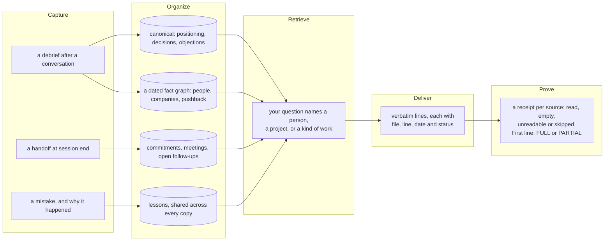
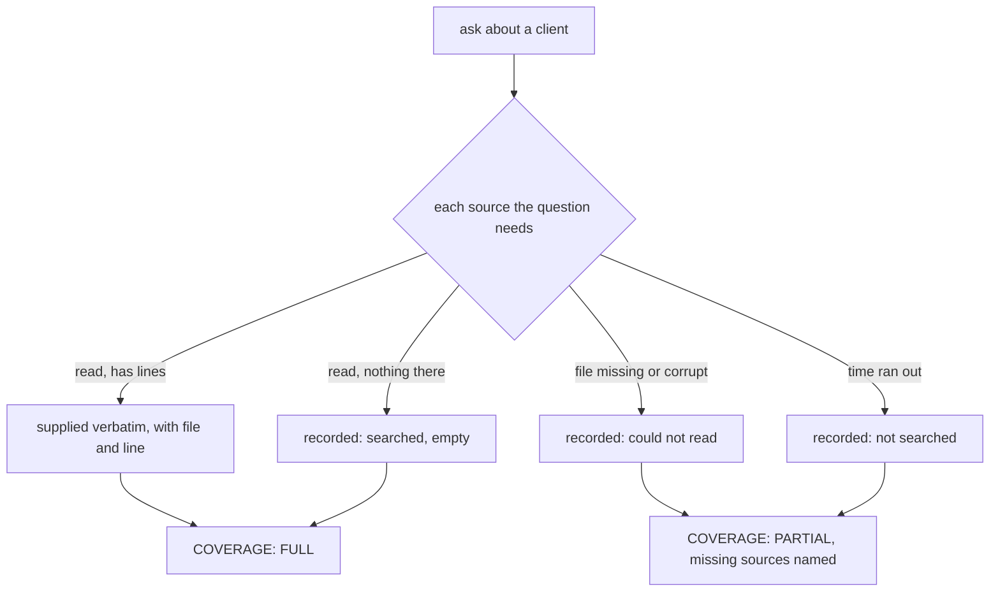
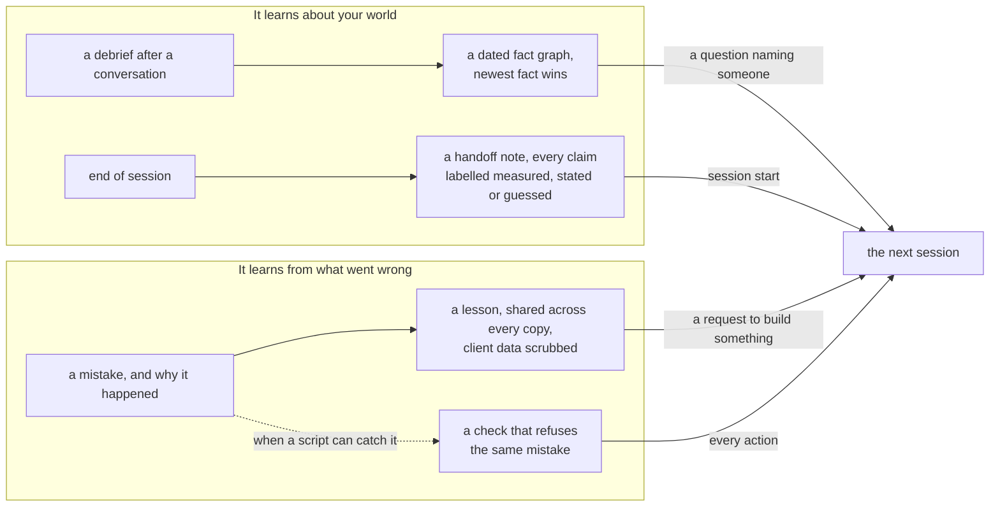
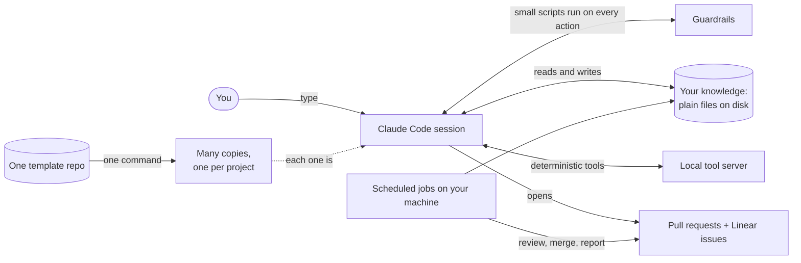
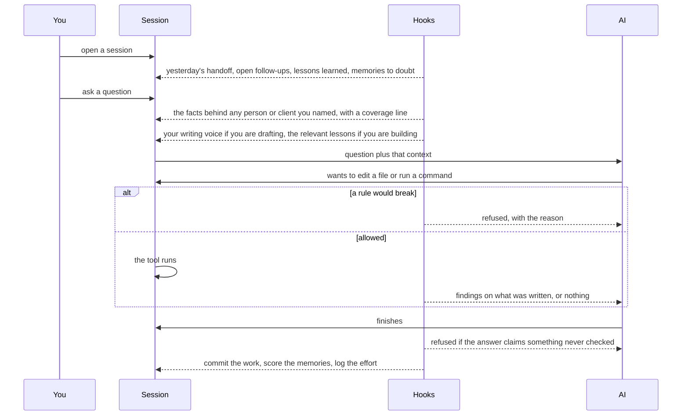
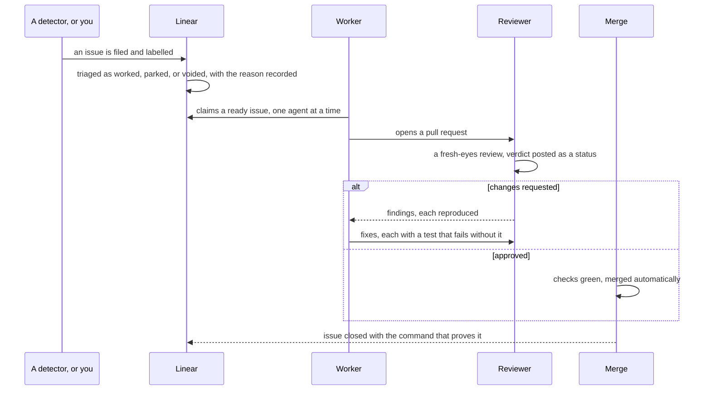
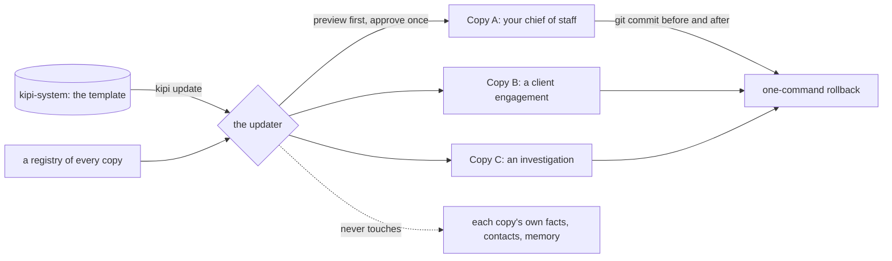

# Kipi

**Give your AI the right knowledge, at the moment it needs it.**

Kipi turns the scattered knowledge around your work into context that follows you across AI sessions: decisions, conversations, projects, people, commitments, lessons, documents, history.

You do not have to remember which file holds something, or tell Claude what to read. Ask a question. Kipi works out what you are asking about, reads the sources that matter for that kind of question, and puts the evidence in front of the model before it answers. Then it tells you what it found, which file and line each piece came from, which sources were empty, and which ones it could not read.

The result is an AI that does not start from zero every conversation. Your brain, externalized, with the plumbing that gets the right memory into active thought.

It runs in Claude Code. Plain markdown all the way down. No vector database, no black box. You can open every fact with `cat` and diff it with `git`.

---

## Memory is not useful if the AI never receives it

Saving information is the easy part. The hard part is getting the right information to the model when it matters.

Kipi's own history is the proof. Every store in the system had a writer and a hook guarding it. The fact graph refused to close a session if it had fallen behind. The commitment ledger dropped any promise it could not quote verbatim. The decision log refused an entry without a tag saying who decided. And nothing read any of it when a question arrived. A question naming a client got none of the client's facts. Careful storage, zero delivery.

So Kipi treats knowledge as a supply chain. Capture. Organize. Retrieve. Deliver. Prove what was delivered.



Ask about a person, and Kipi pulls their relationship history, the decisions that involved them, the commitments made to them, recent meetings, and the open follow-ups. Ask about a project, and a different set of sources becomes relevant. Ask it to build something, and the lessons from previous failures are placed in front of it before it starts.

The model never has to remember to go looking.

---

## It knows when it does not know

An empty search result is not proof that nothing exists. Most retrieval treats it that way.

Kipi's supply step writes a receipt. Every source the question needed is recorded as read, empty, unreadable, or not searched because time ran out. The first line of what the model receives says `COVERAGE: FULL` or `COVERAGE: PARTIAL` and names what is missing.



So there is a difference between these two sentences, and the system says which one is true.

"We searched the relevant sources and found nothing."

"We could not read two of the sources that might hold the answer."

Those should not produce the same confidence. Now they cannot.

---

## Why this is not search-and-paste

Technical readers will file this under retrieval-augmented generation. The retrieval is the boring half. What Kipi cares about is what the retrieval knew.

- Every excerpt is verbatim, with its file and line. There is no summarize step, because a summary is a copy that goes stale while the source moves.
- Every fact carries a status: known, stale, conflicting, or unvalidated. The newest fact on a subject wins. The older one is marked stale, never deleted.
- Every question leaves a receipt naming what was searched and what was not.
- Every name in a question that the index could not resolve goes to a misses ledger. That ledger is the data the next improvement runs on.
- Everything is a file. Open it, grep it, diff it, delete it.

---

## The more you work with it, the more useful its knowledge becomes

It learns in two ways.

**It learns about your world.** People, projects, decisions, preferences, relationships, commitments, terminology, history. A debrief after a conversation writes the facts. A handoff at the end of a session writes what tomorrow needs. Both are files, so both survive.

**It learns from what went wrong.** When the system makes a mistake and you work out why, the lesson becomes durable knowledge supplied to future work. Kipi used to show the model a list of lesson titles and hope it opened one. It did not. It hit the exact failure one of those titles described. Now the relevant lesson bodies are placed in the prompt before the work starts. And where a script can catch the mistake, the lesson becomes a check that refuses it.



It grades itself too. A newer fact supersedes an older one. A handoff line says whether it was measured, stated or guessed. A memory that never gets opened stops being trusted. A source that could not be read is recorded, never assumed empty.

Honest boundary: the lessons path proves the lesson entered the context. It cannot prove the model read it, or that it changed the work that followed. It is stronger than a promise, because a promise leaves no artifact. It is weaker than proof of application, and nothing here claims otherwise.

---

## What makes the knowledge trustworthy

Everything above rests on one thing: the model receives files it cannot talk its way past. That takes machinery. Here is the machinery.



You type into a Claude Code session. Before, during and after every action, small scripts
called hooks run. They add context the AI would otherwise forget, they block actions that
would break a rule, and they record what happened. The session reads and writes plain
files that hold what you know. A local tool server gives the AI checks that return the
same answer every time. Work leaves through pull requests and issues, where scheduled jobs
review, merge and report without you in the loop. All of it lives in one template
repository and is copied to every project you run.

### The ideas underneath

**1. Assume the AI is unreliable.** It invents facts, forgets what it read, agrees with
whoever is talking, and says "done" before anything ran. Nothing here makes it accurate.
Everything here makes its mistakes findable, so a wrong answer leaves a trail and a right
one carries its evidence.

**2. Files are receipts.** A chat transcript is folklore with a timestamp. A file can be
opened tomorrow, searched by a script, diffed, and dated. If you told the system something
and it did not make it into a file, it does not exist the next morning.

**3. Guardrails, not reminders.** A reminder is a sentence the AI is supposed to remember.
A guardrail is a script that runs whether or not anyone remembers. Anything a script can
check is checked by a script that can say no.

**4. You are never the next step.** Engineering signals go to a queue an agent drains. You
decide three things: publish, spend, delete. Everything else has a machine that owns it.

**5. One skeleton, many instances.** Improvements are made once and fanned out. Each copy
keeps its own facts; the template owns the machinery.

### What happens in one turn



When you open a session, hooks put yesterday's handoff, your open follow-ups and the
lessons the whole fleet has learned in front of the AI. When you ask something, they add
the facts behind anyone you named, your writing voice if you are drafting, and the relevant
lessons if you are building. Before a tool runs, a hook can refuse it. After a file is
written, checks run on it. When the AI finishes, a last check can refuse the answer itself
if it asserts something it never opened. Then the work is committed and the session is
scored.

### How work leaves without you



Issues arrive from detectors or from you and are labelled so a machine-filed issue is
distinguishable from a human one. A triage pass records a decision on each so the board
does not only grow. A worker claims an issue under a lock, does the work on a branch and
opens a pull request. A reviewer that has never seen the code reads the diff and posts a
verdict. Fixes carry a test that fails without them. When every check is green, it merges
itself. Red states have machine consumers. When they cannot cope, a ticket says so in an
agent's queue, not yours.

### One template, many copies



Every project is a full copy with its own facts and the same machinery. The updater
previews exactly what would be copied and removed per copy, waits for one approval, then
fans the machinery out and leaves each copy's facts untouched. It commits before and after
so any sync can be reverted alone. A copy with uncommitted work refuses the sync rather
than committing someone else's changes.

---

## The roles it runs today

Every copy shares the same skeleton and differs only in what it knows. Six roles are live right now.

- **Chief of staff.** Tracks conversations, talk tracks, decisions, positioning. Drafts updates, debriefs, follow-ups.
- **PM for a client engagement.** Coordinates multiple projects, logs every decision, drafts deliverables, tracks stakeholder context.
- **Lawyer.** Generates separation packages, contract redlines, compliance memos. Citations to relevant code on every position.
- **Investigator.** Manages active OSINT cases, evidence artifacts, published intel reports.
- **Operator for a consulting business.** Pipeline tracking, content cadence, deliverable production.
- **Architect for itself.** Manages its own PRDs, issues, reviews. The system builds the system.

---

## The full explanation

A handbook is in review as [PR #306](https://github.com/assafkip/kipi-system/pull/306): six short pages for anyone, each with a
drawing and a "what this means for you" section; fifteen deeper pages, one per part of the
system, each with two drawings and every script listed with what it does and the mistake
that made it exist; generated catalogs of every tool, hook, job and rule; and a coverage
check that fails, naming the gap, if any part of the code is missing from the docs. It
lands at `docs/README.md` when that review closes.

---

## Install

```bash
npm install -g @anthropic-ai/claude-code
git clone https://github.com/assafkip/kipi-system.git
cd kipi-system && claude
```

Setup walks you through who you are, what you work on, how you write, and who you know. Takes about 20 minutes. After that the system runs.

---

## Commands

Optional. Most usage is just talking to the system in Claude Code.

| Command | What it does |
|---|---|
| `/q-debrief` | Extract insights from a conversation or paste a transcript |
| `/q-draft` | Quick email, DM, or content draft in your voice |
| `/q-engage` | Generate engagement on someone else's post |
| `/q-research` | Citation-only research mode |
| `/q-morning` | The day brief: one message with your calendar, mail needing an answer, and your board |
| `/q-wrap` | End-of-day health check |
| `/q-handoff` | Save context for next session |
| `/wiring-check` | End-of-task gate: prove every change is connected |

---

## Connects to

Works standalone with local files. Each integration adds capability.

| Tool | Adds |
|---|---|
| Notion | CRM, project tracking |
| Google Calendar | Meeting detection, auto-prep |
| Gmail | Email monitoring |
| Linear | Issue tracking, the autonomous work queue |
| Slack | The morning brief |
| Chrome (DevTools MCP) | Web automation, LinkedIn |
| Apify | X/Twitter scraping |
| Reddit | Search and post tracking |

---

## ADHD-aware, not ADHD-only

I have AUDHD. Some design choices reflect that. Friction-ordered actions. No shame language. Effort tracking. Decision elimination. If you have executive function challenges, the system removes a lot of cognitive load by default.

If you don't, you still get an AI that doesn't make you decide who to contact, what order to do things in, or how to phrase the message.

---

## Security

- `.env`, credentials, and key files blocked from read/write
- PreToolUse hooks intercept dangerous operations
- No secrets in committed files
- `rm -rf`, `sudo`, `git push --force` denied by default; the fleet-wide sync needs an out-of-band approval

---

## Origin

I'm [Assaf Kipnis](https://www.linkedin.com/in/assafkipnis/). 12 years in threat intelligence at LinkedIn, Google, Meta, and ElevenLabs. I burned out fighting the same problems over and over. Left corporate. Started [KTLYST](https://ktlystlabs.com), a security product that turns threat reports into governed, deployable artifacts.

Running a company solo with ADHD meant my brain couldn't hold everything it needed to hold. So I built a second one. It manages my work, writes in my voice, remembers what I forget, and compounds what I learn.

Right now it runs as six roles across every copy of my work. This repo is the general-purpose version. Fork it and teach it yours.
