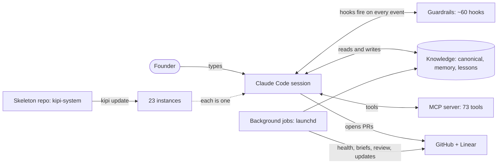

# How kipi works

Kipi is a founder operating system that runs inside Claude Code. It gives one person a
persistent, file-based layer of memory, guardrails and automation around an AI model, so the
model arrives with context, cannot talk its way past checks, and leaves a trail. This book
explains exactly how it works, for two readers at once: someone who has never seen the code,
and an engineer who has to change it.



The picture in one paragraph: the founder types into a Claude Code session. Before, during
and after every action, small scripts called hooks run and either add context, block the
action, or record what happened. The session reads and writes plain files that hold what the
founder knows. A local tool server gives the model deterministic tools (lint this, score
that, log this). Work leaves through pull requests and Linear issues, where background jobs
review, merge and report without a human in the loop. All of this lives in one template
repository, the skeleton, and is copied to every instance the founder runs, one per project.

## The five ideas

1. **Assume the model is unreliable.** Every design choice follows from this. The point is
   not to make the model accurate; it is to make its mistakes findable. Trust moves from the
   model to the trail.
2. **Files are receipts.** Knowledge lives in markdown and JSON lines on disk, never in a
   transcript. A claim without a file behind it wears a label saying so.
3. **Hooks validate, skills generate.** Anything a regex or a script can check is checked by
   a script that can block. Anything that needs judgment lives in an instruction the model
   reads. A rule that only exists as prose is not enforced, and the repo's own lints refuse
   to let a document claim otherwise.
4. **The founder is never the next step.** Engineering signals go to a Linear queue that an
   agent drains. The founder decides three things: publish, spend, delete.
5. **One skeleton, many instances.** Improvements are made once and fanned out. Each
   instance keeps its own facts; the skeleton owns the machinery.

## Where to go next

- New to kipi, or not an engineer: start with [concepts/](concepts/README.md). Six short
  pages, each with a diagram and a "What this means for you" section.
- Changing the code: [systems/](systems/README.md). Fourteen pages, one per subsystem, each
  with a component diagram, a flow diagram, and every script, tool and hook in that
  subsystem with what it does.
- Looking something up: [reference/](reference/README.md). Generated catalogs of every
  script, tool, command, skill, hook, job, rule, agent and CLI verb, produced from the code.

Also in this folder, outside the gate: [kipi-research-brief-business-use.md](kipi-research-brief-business-use.md),
a research brief with a draft post for business readers. Not part of the handbook and not
checked by the coverage gate; it sits here until it has a home of its own.

## How this book stays true

The catalogs in `reference/` are generated from the code by `generate_reference.py`. The
gate `check_coverage.py` enumerates every functionality surface from the code (718 at the
time of writing) and fails, naming the gap, when any one of them is not explained in a
systems page, when a systems page lacks its two diagrams or a caption, when a concepts page
lacks its reader section, or when a catalog has drifted. `test_check_coverage.py` proves the
gate goes red in each of those directions. Run it:

```
python3 docs/check_coverage.py
```

Honest boundary: the gate proves nothing was skipped. It cannot prove a sentence is true.
That is what code review and the scars recorded in each script's header are for.
