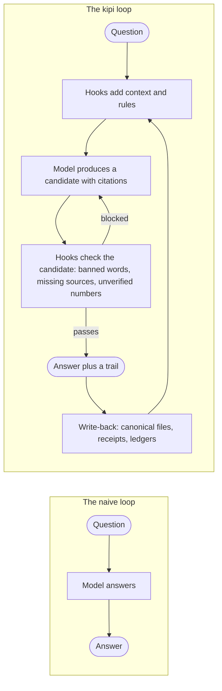

# The unreliable model

Kipi starts from one assumption and never lets go of it: the AI model is unreliable on
complex work. It invents facts, forgets what it read, agrees with whoever is talking, and
says "done" before anything ran. Every design choice in this repository is a consequence of
taking that seriously instead of hoping it away.

The response is not to make the model accurate. Nobody can. The response is to make the
model's mistakes findable, so that a wrong answer leaves a trail you can follow and a right
answer carries the evidence that makes it right.

The two loops side by side. In the naive loop the model's output is the answer, and a wrong
answer is a silent failure. In the kipi loop the model's output is a candidate; scripts run
before it (to put the right context in front of the model) and after it (to refuse output
that breaks a rule), and whatever survives is written back to files so the next question
starts from a better place. Nothing in the second loop makes the model smarter. It makes the
model's errors visible and its good work durable.

## Four habits that follow

- **Label what is not proven.** A claim the system cannot back with a file wears a marker
  such as `{{UNVALIDATED}}`, and the lints refuse to let that marker be dropped quietly.
- **Prefer the more rigorous file.** When two files disagree, the one with timestamps and
  provenance wins and the other is corrected to match.
- **Second opinions are structural.** A separate verifier re-derives numbers; a different
  model reviews every pull request; a "council" of personas argues before a strategy file
  changes.
- **Sycophancy is measured.** The system tracks how often its own recommendations sail
  through unexamined and flags the ratio when it gets too high.

## What this means for you

When a session blocks you, adds a warning, or refuses to say "done", that is this idea at
work. The block is not the model being difficult; it is a script that cannot be argued
with, catching something the model would have let through. If you see a label like
`{{UNVALIDATED}}` in an output, the system is telling you it could not find a file behind
that sentence. Treat that as the useful part.
