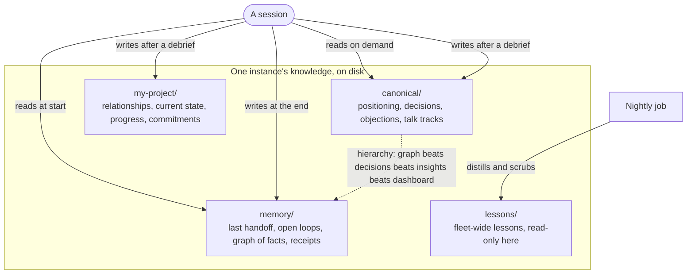

# Files are receipts

A chat transcript is folklore with a timestamp. Once the window closes it is gone, and even
while it is open nothing else can read it. Kipi keeps knowledge in plain files on disk:
markdown for prose, JSON lines for records. A file can be opened by the next session, by a
script, by a test, and by a person. A file has a modification time. A file can be diffed.
That is what makes it a receipt rather than a memory.

Four folders hold what an instance knows. `canonical/` is the founder's curated truth about
the business: positioning, decisions with their origin, objections and the answers to them.
`my-project/` is the running state: who the contacts are, what was promised, what changed.
`memory/` is continuity: what the last session left behind, which follow-ups are open, a
graph of dated facts, and receipts for what was searched. `lessons/` arrives from the whole
fleet and is read-only in an instance. A session reads the continuity files at start,
reaches for canonical files when a question needs them, and writes back after a debrief or
at the end. When two files disagree, a fixed hierarchy decides which one is corrected.

## Rules that keep files honest

- **Origin on every decision.** A decision line without a tag saying who decided (the
  founder, the model with approval, a debate) is refused by a lint.
- **Provenance on every inherited claim.** A handoff line that states a fact without saying
  whether it was measured, observed, stated, or inferred is refused by a lint.
- **Numbers trace to a ledger.** A client-facing draft carrying a number that no verified
  evidence row backs is refused by a gate.
- **Budgets, not silent truncation.** Prose files that grow past a line budget have their
  oldest sections archived by a script, never cut.
- **Untracked by design.** Per-instance record files such as the fact graph never enter git
  in a public repository; a pre-commit hook refuses them.

## What this means for you

If you told the system something in a conversation and it did not make it into a file, it
does not exist the next morning. The debrief flow exists to move conversation into files.
When you want to know what the system believes, open the file; the session's answer is a
view of it, and the file wins.
