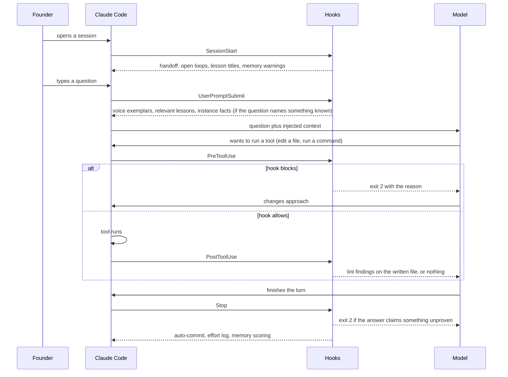

# Guardrails, not reminders

A reminder is a sentence somebody is supposed to remember. A guardrail is a script that
runs whether or not anyone remembers. Kipi has a hard rule about the difference: any
behavior that a script could check is checked by a script, and a document may only call a
rule ENFORCED when it names the executable behind it. Two lints hold that line on every
write: `prompt-only-enforcement-guard.py` and `enforced-claim-lint.py`.

The scripts are called hooks. Claude Code fires them at fixed moments in a session, and
each one can do one of three things: add context, record something, or block the action
with a message the model has to act on.

One turn of a session, with every hook moment shown. At session start, hooks put yesterday's
handoff, the open follow-ups and the lesson titles in front of the model. When the founder
types, hooks look at the words and inject the voice corpus if it is a writing request, the
relevant lessons if it is an engineering request, and the instance's own facts if it names
a person, client or capability. Before a tool runs, a hook can refuse it: a write into the
configuration directory, a destructive command, a merge that skips the checks. After a file
is written, lints run on it and report findings. When the model finishes, a last set of
hooks can refuse the answer itself if it asserts something it never checked, then commit the
work and record the session.

## The two contracts every hook obeys

- **Exit code.** Zero means pass. Two means block, and whatever the script wrote to its error
  stream is fed back to the model as the reason. A missing script is a no-op, so an
  instance that has not received a hook yet is not broken by it.
- **Envelope.** A hook that wants to add context must wrap it in a specific JSON shape with
  the event name inside it. Claude Code silently discards any other shape. This was
  measured, not read from documentation, and an audit script now checks every hook for it.

## What a hook cannot do

A hook sees the tool call, the file, or the transcript. It does not see the model's
reasoning, and it cannot tell whether the model read what was injected. So the judgment
half of every rule (tone, whether a skill should fire at all, whether a plan is grounded)
stays in an instruction, and the documentation says so rather than pretending. Where the
system wants to know whether a skill actually fires, it measures that on demand with a
separate harness, at real cost, and treats the result as advisory.

## What this means for you

A block is not a bug. It is the one moment where the system is certain. When you hit one,
the message tells you the sanctioned path: a proposal file for configuration changes, an
out-of-band approval for destructive commands, a fix to the check rather than a route
around it. Blocks that fire on their own population get switched off, so a new hook ships
as advisory until the repo is clean enough to survive it turning red.
