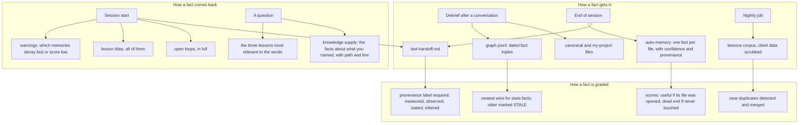

# Memory that earns trust

Kipi has several memories, and they are not equal. Each one was added because a previous
one failed in a specific, recorded way, and each carries its own rules for when it is
believed, when it is doubted, and when it is thrown away. The system does not "remember";
it keeps records and grades them.

Three columns: how a fact gets written, how it comes back, and how it is graded. Facts enter
through a debrief (into the curated files and the fact graph), through the end-of-session
handoff and auto-memory, and through a nightly job that turns each instance's learnings
into fleet lessons with client data removed. Facts come back at session start (handoff,
open loops, every lesson title, and warnings about which memories to doubt) and again when
a question names something the instance knows. Grading happens on its own: an auto-memory
scores useful when its source file was opened in a session and dead end when it never was;
a state fact in the graph is marked stale when a newer one supersedes it; a handoff line
must say how it was known; a lesson that repeats an existing one is caught.

## Why so many layers

- **Titles were not delivery.** A session was handed 155 lesson titles, opened none, and
  hit the exact scar one of them described. The fix was to inject the relevant lesson
  bodies at the moment of the question, not to ask the model to read more carefully.
- **A stored claim is not a verified one.** Handoffs mixed measurements with guesses in one
  voice, and a wrong guess rode into a client draft. The fix was a provenance vocabulary
  with ranks, loaded by two lints from one table.
- **Write-only stores rot.** The fact graph had a freshness guard and no reader at all. The
  fix was a reader that supplies facts on the question path and writes a receipt naming
  every source it searched and every one it could not.
- **Some layers are dead.** The working, weekly and monthly memory folders described in
  older documentation have no writer, no promoter and no reader. They are listed under
  Retired in the systems pages so nobody builds on them.

## What this means for you

At the start of a session you will see a block of context you did not ask for: the last
handoff, open follow-ups, lesson titles, and warnings marked fast-decay or low-confidence.
The warnings are the useful part; they mean "verify before you act on this". When you ask
about a person or a client, a first line reading `COVERAGE: FULL` or `COVERAGE: PARTIAL`
tells you whether every source that should have been searched was, and names the ones that
were not. "I did not find it" and "I never looked there" are different sentences, and the
system now says which one it means.
