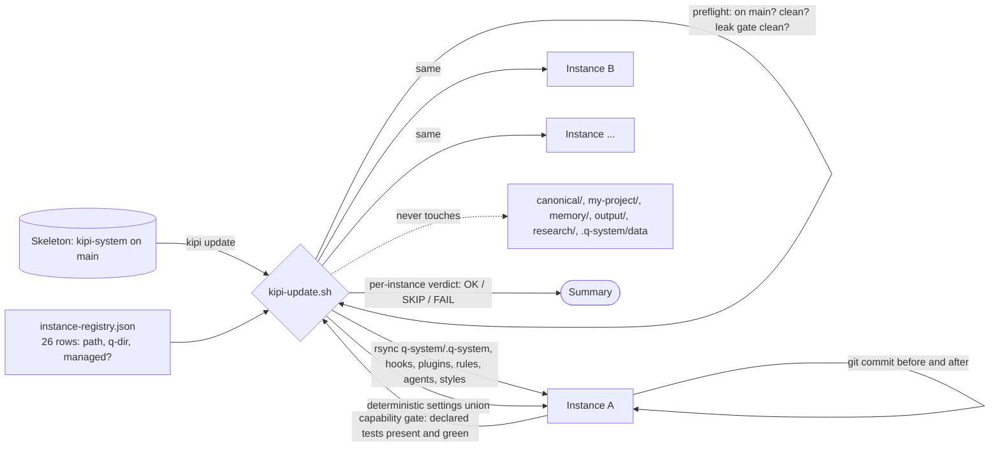

# One skeleton, many instances

Kipi is one repository, called the skeleton, copied into every project the founder runs. A
copy is an instance. The skeleton owns the machinery: hooks, scripts, plugins, rules,
agents. Each instance owns its facts: its canonical files, its contacts, its memory. An
improvement is made once in the skeleton and fanned out to every instance by one command;
an instance's facts are never touched by that fan-out.

The fan-out. A registry file lists every instance, where it lives, and whether it is
managed. The updater refuses to run unless the skeleton is on its main branch with a clean
tree and the leak gate reports clean. For each instance it copies the machinery
directories, merges the instance's settings with the template so hooks land without
clobbering local permissions, and skips the instance-owned directories entirely. It commits
the instance before and after so every sync is revertable, runs the instance's capability
gate to prove its declared tests are present and green, and reports one verdict per
instance. An instance with uncommitted work refuses the sync rather than committing
someone else's changes.

## Guards on the fan-out, each from a scar

- **Never delete instance data.** A deletion guard refuses a sync whose delete flag would
  remove an instance-owned file. A preserve scan finds tracked instance-only files that a
  sync would clobber. Both came from a day a package vanished from nineteen instances.
- **Preview is a real run against a throwaway.** The dry run performs the update against a
  disposable clone and tags every line so a preview log can never be mistaken for an apply.
- **The dangerous command needs a person.** A hook refuses the fleet-wide sync unless the
  founder approved that exact command out of band within five minutes.
- **Leaks are fingerprinted.** Text that would carry one instance's private facts into the
  shared skeleton is caught against a baseline before anything is copied.
- **Rollback is one command.** Each instance's last sync commit can be reverted alone.

## Where the running copy actually lives

Plugins do not run from the repository. Claude Code runs them from a marketplace clone
under the user's home directory, cached by version and pinned per session. A change to a
plugin is not live until it is merged, the clone refreshed, the version bumped and Claude
Code restarted, and a check exists that fails when the running copy is older than the
merged one. Editing an instance's own plugins directory does nothing: it is a destination
the next sync overwrites.

## What this means for you

Each project you work in is a full copy with its own facts and the same machinery. When
you see "run kipi update", that is the fan-out; the preview shows exactly what would be
copied and removed, per instance, before you approve it. An instance that says it refused
the sync because its tree was dirty is protecting work, not failing. And if a fix seems not
to have arrived, the first question is which copy is running, not whether the fix is right.
