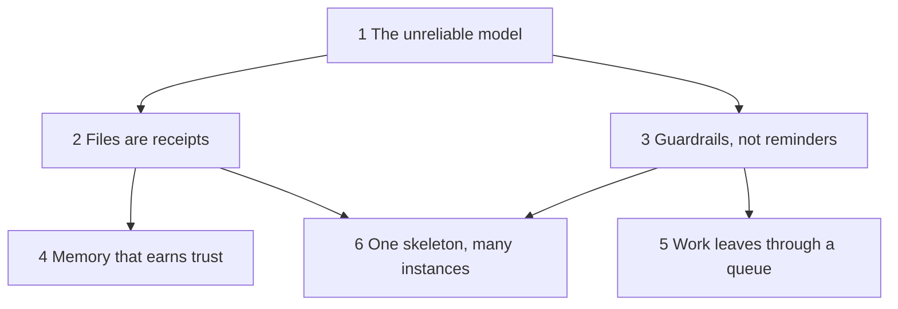

# Concepts: kipi for people who do not read code

Six ideas, each on its own page, each with one diagram and a section called "What this
means for you". Read them in order the first time; after that, each stands alone.

1. [The unreliable model](01-the-unreliable-model.md): why everything is built the way it is.
2. [Files are receipts](02-files-are-receipts.md): where knowledge lives and why not in chat.
3. [Guardrails, not reminders](03-guardrails-not-reminders.md): what a hook is and what it can and cannot do.
4. [Memory that earns trust](04-memory-that-earns-trust.md): how the system remembers, forgets, and grades itself.
5. [Work leaves through a queue](05-work-leaves-through-a-queue.md): how a task becomes a merged change with no human in the middle.
6. [One skeleton, many instances](06-one-skeleton-many-instances.md): how one repository runs many projects.

Reading order in one paragraph: everything starts from the assumption that the model is
unreliable. That assumption produces two habits, keeping knowledge in files and checking
work with scripts. Files lead to a memory system that grades its own entries. Scripts lead
to an automated queue that reviews and merges work. Both are copied from one template to
every project.

## What this means for you

Nothing on these pages needs to be memorised. Each one exists so that when something in a
session surprises you (a block, a warning, a line of injected context), you can find the
page that explains what fired and why in under a minute.
