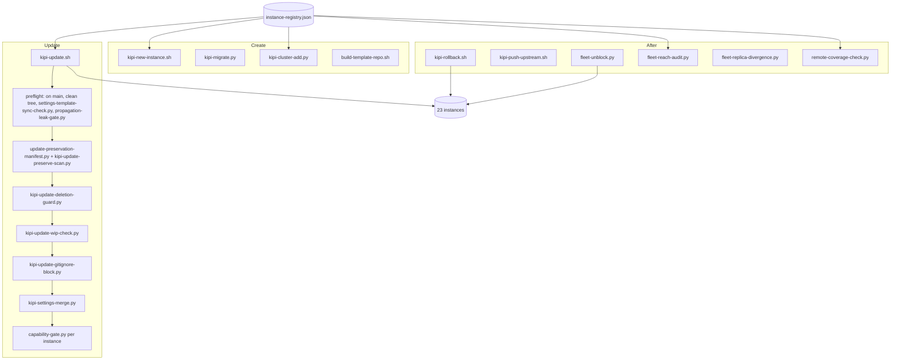
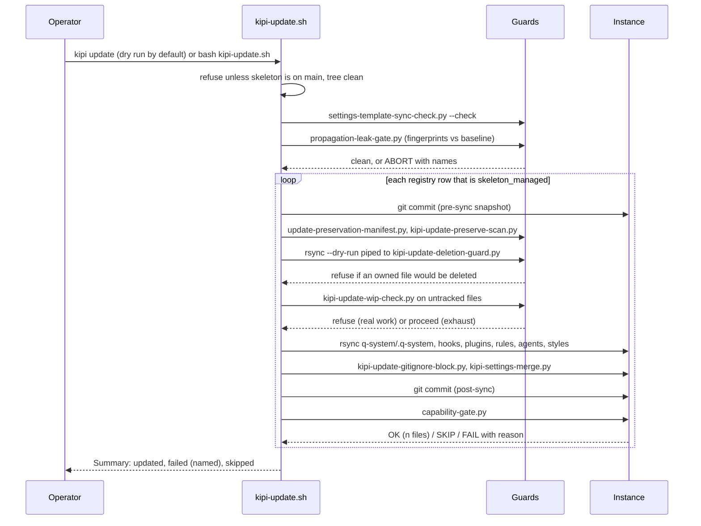

# 01. Instances and the fleet

The skeleton is this repository. An instance is a copy of it that runs one project. The
fleet is every instance the registry knows about. This subsystem creates instances, fans
skeleton changes out to them without touching their facts, guards that fan-out against the
ways it has destroyed data before, and rolls a bad sync back.

## Components

Three groups around one registry. Creation scripts scaffold a new instance from the
skeleton, migrate an old one to the current layout, or register a cluster member. The
updater is a pipeline of guards followed by the copy: preflight refuses to start unless
the skeleton is on main with a clean tree and both the settings-sync check and the leak
gate are clean; a preservation manifest and scan record what the instance owns; the
deletion guard reads a dry rsync and refuses one that would delete owned data; the
work-in-progress check separates real uncommitted work (refuse) from updater exhaust
(proceed); the gitignore block ships the never-commit stanza; the settings merge unions the
template into the instance's settings; the capability gate then proves the instance's
declared tests are present and green. After a sync, rollback reverts one instance's sync
commit, push-upstream carries a generic improvement back, unblock clears updater exhaust,
and three audits report why an instance cannot receive an update, whether replicated
files diverge, and whether any repo's only copy lives on one machine.

## Flow: one `kipi update` run

The order matters and every step is a refusal point. The snapshot commit before the copy
is what makes rollback one command. The preservation pair and the deletion guard run
before any byte moves. The work-in-progress check is why an instance with the founder's
own uncommitted edits says "dirty working tree; refusing to commit unrelated work" instead
of quietly committing them. The capability gate at the end is the receipt that the
instance still has every test it declared, so a sync that silently deleted a test cannot
report OK.

## Every piece

Registry and creation
- `instance-registry.json`: one row per instance: name, path, optional q-dir, managed flag. The source of truth for every fleet script.
- `kipi-new-instance.sh`: scaffolds a new instance from the skeleton, seeds the memory graph file, registers it. Called by `kipi new`.
- `kipi-migrate.py`: brings an older instance to the current compliance layout, programmatically and reversibly. Called by `kipi migrate`.
- `kipi-cluster-add.py`: registers a cluster member with a role. Called by `kipi cluster add`.
- `build-template-repo.sh`: produces a clean fork-ready template for non-technical users, with private material stripped.
- `persona-reorg.py` and `reorg-stale-ref-audit.py` (scripts/): the reversible fleet reorganisation tool used when projects moved between personas, and its reproducer that checks for stale path references afterwards.
- `ensure_instance_kb.py` (scripts/): creates a `memory/graph.jsonl` in every registered instance that lacks one, idempotently.

The updater and its guards
- `kipi-update.sh`: the fan-out. Preflight, per-instance guard chain, rsync of the managed prefixes, settings union, commits, capability gate, summary. Dry run performs the update against a disposable clone and tags every output line so a preview cannot be mistaken for an apply. Tested by 12 root-level `test-kipi-update-*.sh` scripts (armed marker, bash 3.2 arrays, cache exclusion, config commit unwind, data-loss guards, dirty-guard scope, dry tagging, never-commit coverage, preserve integration, preserve scan, restore recovers) plus `test-slack-notify-label.sh`.
- `settings-template-sync-check.py`: refuses when a hook is wired in the skeleton's settings but missing from the template, which would ship its script to the fleet with the switch dead. Runs as preflight and as a PostToolUse hook.
- `propagation-leak-gate.py` with `containment-targets.py` and `verify-containment-export.py`: fingerprints text that would carry one instance's private facts into the shared skeleton, compares against a baseline, and refuses to propagate on a new leak. The export verifier retains failed-owner payloads safely.
- `update-preservation-manifest.py`, `kipi-update-preserve-scan.py`: build the registry-derived manifest of instance-owned files and find tracked instance-only files a sync would clobber.
- `kipi-update-deletion-guard.py`: reads the dry rsync and refuses a sync whose delete flag would remove instance-owned data.
- `kipi-update-wip-check.py`: decides whether an untracked instance file is work (refuse) or exhaust the updater itself wrote (proceed).
- `kipi-update-gitignore-block.py`: ships the instance-local never-commit stanza.
- `kipi-settings-merge.py`: rebuilds an instance's settings from the template with a deterministic union that preserves the instance's MCP servers, permissions and local hooks. Running it standalone bypasses the gates (a recorded spillover, sp-9961ac50).
- `instance-automation-guard.py`: PostToolUse hook in the template; blocks a script written into an instance's synced subtree, which the next sync would clobber. Skeleton self-detects and no-ops.
- `control-file-propagate.py`: brings one named control file into one instance on demand.
- `stat-registry-extract.py`: audits and regenerates the canonical statistics registry that voice tooling reads.

After a sync
- `kipi-rollback.sh`: reverts the last skeleton-sync commit in one instance. Called by `kipi rollback`.
- `kipi-push-upstream.sh`: carries a generic improvement from an instance back to the skeleton. Called by `kipi push`.
- `fleet-unblock.py` (tested by `test_fleet_unblock.py`): clears updater exhaust out of instances, only what it can attribute.
- `fleet-reach-audit.py`: read-only report of why each instance cannot receive an update.
- `fleet-replica-divergence.py`: hashes every copy of every fleet-replicated file and reports divergence.
- `remote-coverage-check.py`: fails when any repo's only copy lives on one machine. Called by `kipi check`.
- `fleet-capability-verify.py`: runs the capability gate in every registered instance.
- `instance-diet.py`, `instance-diet-fix.sh`: trim an instance's CLAUDE.md and repair its imports.
- `instance-fact-inventory.py`: builds a redacted inventory from ephemeral instance-fact candidates for the leak gate.
- `validate-separation.py`: the validation harness behind `kipi check` (skeleton versus instance separation, agent model IDs, and more).
- `snippet.sh`, `fix-imports.sh`, `fix-perm-wildcards.py`, `fix-voice-style.py`: one-off repair tools kept at the root; each says in its header what it fixed.

## Scars

- 2026-08-07: a source tree missing one package removed it from nineteen instances in one run. Result: the deletion guard, the preservation manifest, the out-of-band approval on the fleet-wide command.
- 2026-06-15: the updater hung for minutes on an instance pre-commit hook scanning a large staged set. Result: `--no-verify` on the updater's own commits.
- 2026-08-16: an unattended auto-commit swept another session's half-applied files on a shared checkout. Result: the work-in-progress check and the per-session worktree convention.

## Retired

- `kipi sync-skills`: skills now ship as marketplace plugins; the verb prints DEPRECATED and exits.
