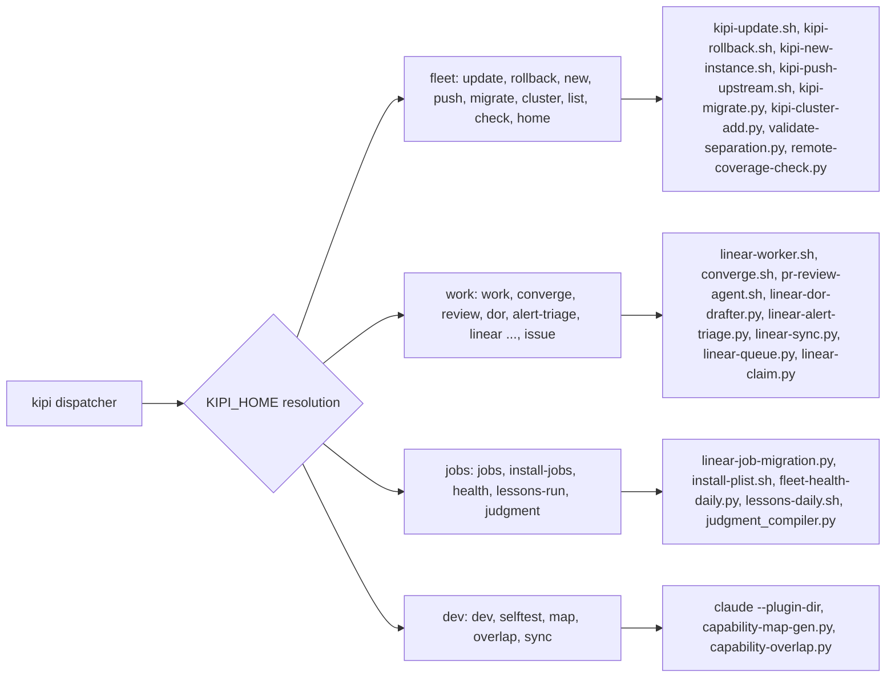
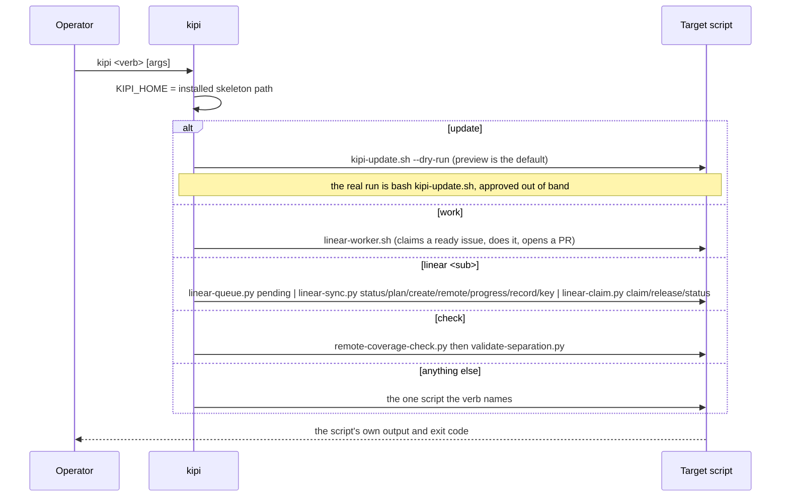

# 02. The kipi CLI

`kipi` is a bash dispatcher installed globally. It exists so the founder never has to
remember a path or a script name: each verb maps to one script in the skeleton, and the
dispatcher resolves the skeleton's location for you. It is thin by design; every verb's
behavior lives in the script it calls.

## Components

The dispatcher reads its home directory, then routes one verb to one script. Fleet verbs
run the updater family. Work verbs drive the Linear loop: the worker, the converge loop, the
reviewer, the readiness drafter, the alert triage, and the queue and sync subverbs. Job
verbs install and check background jobs. Dev verbs start a session with the plugins loaded
from disk and generate capability maps.

## Flow: what a verb does

Every verb is one hop. The two worth knowing: `kipi update` is a preview, never an apply,
so the apply is a deliberate second step with its own approval; and `kipi check` runs two
validators in sequence, the remote-coverage gate then the separation harness.

## Every verb

Fleet
- `kipi update`: preview the fan-out (`kipi-update.sh --dry-run`). The real run is `bash kipi-update.sh` and needs the out-of-band approval the destructive-op hook asks for.
- `kipi rollback [instance]`: revert the last skeleton-sync commit in one instance (`kipi-rollback.sh`).
- `kipi new <path> <name>`: create an instance (`kipi-new-instance.sh`).
- `kipi push`: carry a generic improvement back to the skeleton (`kipi-push-upstream.sh`).
- `kipi migrate`: bring an instance to the current layout (`kipi-migrate.py`).
- `kipi cluster add <path> <name> <role>`: register a cluster member (`kipi-cluster-add.py`).
- `kipi list`: print the registry.
- `kipi check`: `remote-coverage-check.py` then `validate-separation.py`.
- `kipi home`: print the skeleton path.
- `kipi sync`: alias family kept for older muscle memory; routes to the same fleet scripts.

Work
- `kipi work`: the autonomous worker (`linear-worker.sh`).
- `kipi converge <issue>`: drive one issue to an approved PR (`converge.sh`).
- `kipi review <pr>`: the PR reviewer (`pr-review-agent.sh`).
- `kipi dor`: draft Definitions of Ready onto issues that lack one (`linear-dor-drafter.py`).
- `kipi alert-triage`: triage the fleet-alert bucket (`linear-alert-triage.py`).
- `kipi issue`: issue-first fast path that pairs with the commit-message gate.
- `kipi linear pending` (`kipi pending` in the dispatcher's case table): what the offline queue captured (`linear-queue.py`).
- The idempotent planner (`linear-sync.py`), reachable as `kipi status`, `kipi plan`, `kipi create`, `kipi remote`, `kipi progress`, `kipi record`, `kipi key` under the linear verb.
- The claim lock (`linear-claim.py`): `kipi claim`, `kipi release`, `kipi claims` under the linear verb.
- `kipi map`, `kipi overlap`: capability maps and cross-repo overlap (`capability-map-gen.py`, `capability-overlap.py`).
- `kipi promote <path>`: the up-rail; moves one general capability from an instance up to the skeleton (`kipi-promote.sh`); runs from an instance checkout with the skeleton's registry exported.
- `kipi cluster add`: the `kipi add` subverb of cluster (`kipi-cluster-add.py`).

Jobs
- `kipi jobs`: one tracked Linear issue per scheduled job (`linear-job-migration.py`).
- `kipi install-jobs`: install every committed launchd template (`install-plist.sh --all`).
- `kipi health`: the daily fleet health check (`fleet-health-daily.py`).
- `kipi lessons-run`: the nightly learning heartbeat, by hand (`lessons-daily.sh`).
- `kipi judgment`: the judgment compiler against the caller's repo.

Dev
- `kipi dev`: start Claude with all plugin groups loaded from disk (`claude --plugin-dir ...`).
- `kipi selftest`: the dispatcher's own smoke test.
- `kipi map`, `kipi overlap`: top-level aliases of the linear map and overlap subverbs.

## Slash commands that are not kipi verbs

The kipi-core plugin ships six slash commands that run inside a session rather than from
the shell: `/wiring-check` (page 08), `/linear-drain` (page 09), `/voice-refresh` (page 06),
`/rca-start` and `/rca-check` (scaffold a root-cause analysis from the canonical template
and lint one against it; the rca skill carries the method and `rca-lint.py` blocks a
malformed document), and `/say` (synthesize the previous assistant response to an mp3
through OpenAI text-to-speech and autoplay it locally in a new Terminal window, because
the slash-command sandbox blocks AppleEvents; over SSH it prints the play command). The
kipi-dsse and prd-os commands are on page 08.

## Scars

- The plugin-command scope scar: a plugin's slash commands vanish when its install record
  is scoped to another project while its skills still load. `kipi dev` loads from disk,
  which is the diagnostic that tells the two apart.

## Retired

- `kipi sync-skills`: prints DEPRECATED; skills ship as marketplace plugins now.
