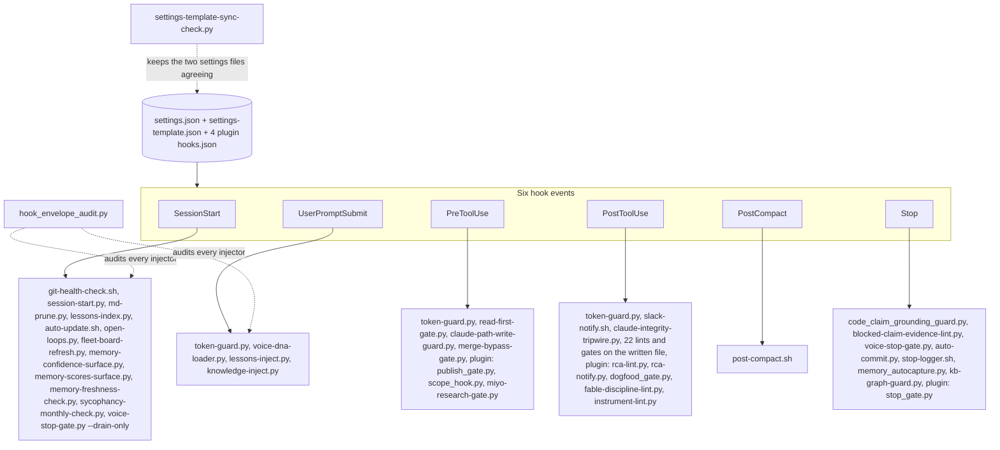
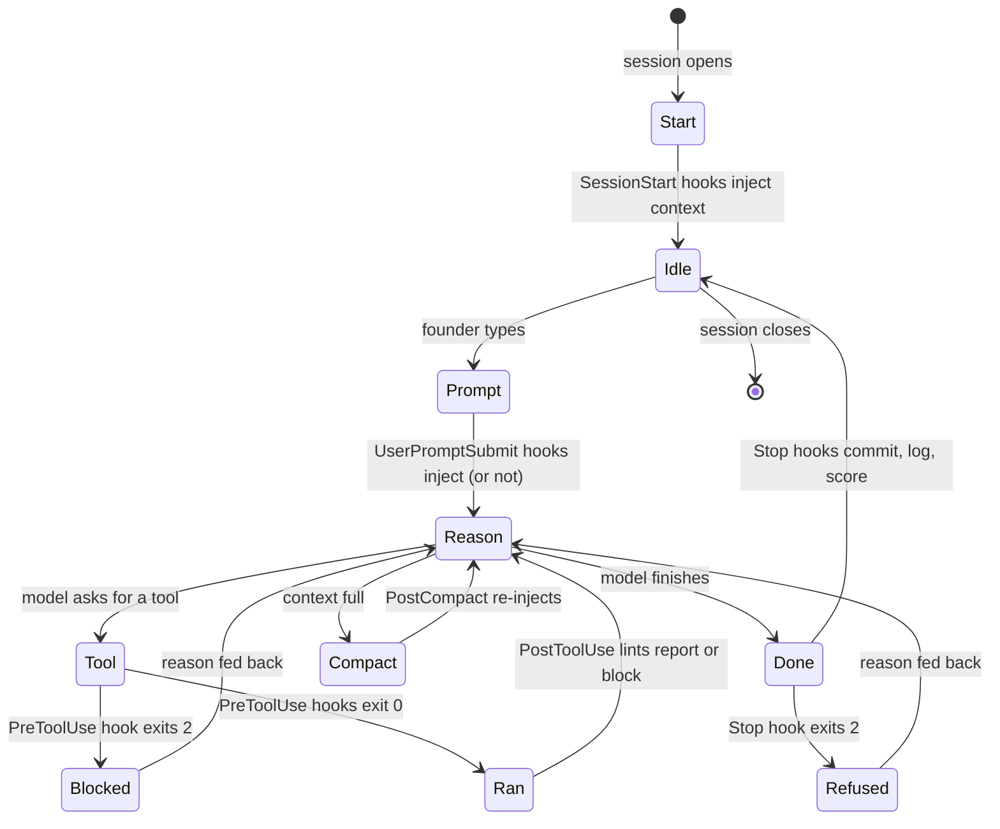

# 03. Session lifecycle and hooks

A Claude Code session fires hooks at six moments: when it starts, when the founder submits
a question, before a tool runs, after a tool runs, after context is compacted, and when the
turn ends. Kipi wires 56 hooks into `.claude/settings.json` (and the same set, with a
missing-script guard, into `settings-template.json` so instances receive them), plus seven
more from plugin hook files. This page is the spine of the runtime: every other in-session
subsystem is reached from here.

## Components

Six events, each with its scripts in wiring order. SessionStart injects context (handoff,
loops, lesson titles, memory warnings) and runs housekeeping (git health, markdown pruning,
the update nudge, the fleet board). UserPromptSubmit is the supply layer: the token guard
counts, then three injectors add voice exemplars, relevant lessons, and instance facts,
each only when the prompt matches its trigger. PreToolUse is where blocks live: the token
guard's ceilings, the read-first gate on the first write, the two guards on the
configuration directory and the merge path, and plugin gates on publishing, issue scope and
research. PostToolUse is the lint wall: after a file is written, every lint that applies to
its path runs and reports or blocks. PostCompact re-injects what compaction dropped. Stop
is the last word: two guards can refuse the answer itself, then the auto-commit, the effort
log, memory scoring and the graph freshness guard run. Two audits keep the wiring honest:
one checks every injector's envelope, one checks the two settings files agree.

## Flow: one turn

A turn as a state machine. The model reasons, asks for tools, and finishes; at each edge a
hook can push it back with a reason. A refused tool call returns to reasoning with the
block message; a refused answer at Stop does the same. Compaction is a side loop that
returns with the mode, loop stats, product context and voice reminders re-injected.

## The two contracts

- **Exit code.** 0 passes. 2 blocks and feeds stderr to the model. The `test -f X && python3 X` shape in the template makes a missing script a no-op; `|| true` makes a hook advisory.
- **Envelope.** Injected context must be `{"hookSpecificOutput": {"hookEventName": "<Event>", "additionalContext": "..."}}`. Measured 2026-08-30 by `probe_hook_envelope.py`: the nested shape without the event name and the top-level shape are both silently discarded. `hook_envelope_audit.py` (PostToolUse) blocks a hook file that emits the wrong shape.
- **Timeouts.** A hook that overruns its wired timeout is killed and its exit 2 discarded, so the tool call proceeds. Measured 2026-08-03. Every blocking hook is wired at 5 to 20 seconds and does its slow work detached.

## Every piece

SessionStart
- `git-health-check.sh`: reports divergence from the remote and stray state.
- `session-start.py`: injects the last handoff, yesterday's unconfirmed action cards, the open-loop banner (reports "ledger unreadable" as a different sentence from "nothing open"), and whether today's morning routine ran. Once per day via a sentinel.
- `session-context.sh`: the older shell form of the same injection (date, handoff, energy), kept for instances that still wire it.
- `md-prune.py`: archives the oldest sections of any prose file over its line budget into `memory/archives/`.
- `lessons-index.py`: injects every lesson title (no cap; a ceiling fails a test instead of dropping entries).
- `auto-update.sh`: nudges when the skeleton is ahead; never pulls.
- `open-loops.py`: injects every open loop in full, with the fleet board's staleness note.
- `fleet-board-refresh.py`: says when the fleet loop board is stale and how to republish it; `fleet-loop-board.py` generates it.
- `memory-confidence-surface.py`, `memory-scores-surface.py`, `memory-freshness-check.py`: surface low-trust, contested or stale, and fast-decay memories.
- `sycophancy-monthly-check.py`: on the first of the month, computes the rubber-stamp ratio.
- `voice-stop-gate.py --drain-only`: drains the previous session's pending voice findings.
- `statusline.sh`: the status bar (loops, mode); not a hook event but wired in the same file.

UserPromptSubmit
- `token-guard.py`: counts calls and records the prompt.
- `voice-dna-loader.py`: on a writing-intent match, injects the voice corpus selector output and the substance files.
- `lessons-inject.py`: on an engineering-intent match, injects the three most relevant lesson bodies by term overlap.
- `knowledge-inject.py`: on a resolved entity or capability phrase, injects the instance's own facts with path, line, status and a coverage line (see page 05).

PreToolUse
- `token-guard.py`: the circuit breaker. Detectors: exact retry (3), edit spiral (3), read spiral, grep drift, time stall, agent and MCP ceilings, a 50-call volume ceiling that resets on a commit. Three of its refusals also request a cross-model triage (`fable-escalate.py`, page 09), detached and never awaited.
- `read-first-gate.py`: before the first Write or Edit of a session, requires that `anti-hallucination.md` and at least one lesson file were opened by any tool.
- `claude-path-write-guard.py`, `merge-bypass-gate.py`: page 04.
- Plugin: `publish_gate.py` (kipi-design) requires a design-room receipt for deliverables under a `design-room/` directory; `scope_hook.py` (kipi-dsse) refuses edits outside the active issue's allowed files; `miyo-research-gate.py` (template, consulting scope) blocks a fourth manual search before the knowledge base was queried.

PostToolUse
- `token-guard.py`, `slack-notify.sh` (page 10), `claude-integrity-tripwire.py` (page 04).
- Lints on the written file, each self-scoped by path and each documented on its own page: `prompt-only-enforcement-guard.py`, `enforced-claim-lint.py`, `wiring-check.py`, `plan-lint.py`, `instrument-lint.py`, `voice-lint.py`, `linkedin-format-lint.py`, `headline-lint.py`, `batch-uniformity-lint.py`, `format-lint.py`, `linear-filer-label-lint.py`, `audhd-lint.py`, `decision-origin-tag-lint.py`, `voice-substance-lint.py`, `lessons-validator.py`, `memory-confidence-validator.py`, `spillover-ratchet.py`, `settings-template-sync-check.py`, `hook_envelope_audit.py`, `client-output-evidence-gate.py`, `handoff-provenance-lint.py`, `portability-lint-hook.py`.
- Plugin: `rca-lint.py` and `rca-notify.py` (kipi-core), `dogfood_gate.py` (kipi-design), `fable-discipline-lint.py` (prd-os).

PostCompact
- `post-compact.sh`: re-injects the operating mode, loop stats, the first lines of the product state and talk tracks, and the active rules.

Stop
- `code_claim_grounding_guard.py`: refuses an answer that asserts something about a repo file the session never opened, or names a manifest subsystem whose members were not all read.
- `blocked-claim-evidence-lint.py`: a report saying "blocked" must carry the evidence.
- `voice-stop-gate.py`: final voice check on the chat output itself; also counts corpus-similarity drift and files an alert on state change.
- `auto-commit.py`: groups changed files by area and commits with a generated message and a `[no-issue]` hatch. Stages to whatever branch is checked out, which is the recorded worktree scar.
- `stop-logger.sh`: appends the session effort entry.
- `memory_autocapture.py`, `kb-graph-guard.py`: page 05.
- Plugin: `stop_gate.py` (kipi-dsse) refuses to end a turn with an unrecorded issue state.

Tooling for the hooks themselves
- `hook_envelope_audit.py`, `probe_hook_envelope.py`: the envelope contract and the measurement that established it.
- `settings-template-sync-check.py`: the two settings files agree.
- `mcp-denylist-namespace-check.py`: refuses an MCP denylist namespace that names no server.
- `fix-perm-wildcards.py`: dropped stale mid-command wildcard allow rules from settings.

## Scars

- 2026-07-02: every warning tier of the token guard was invisible for weeks because its
  context went out top-level. Result: the envelope contract and the audit hook.
- 2026-07-28: conclusions were issued before evidence and reversed six times in one session.
  Result: the read-first gate, the grounding guard, and the evidence ledger (page 07).
- 2026-08-16: two sessions on one checkout; an auto-commit captured the other's half-applied
  state. Result: per-session worktrees, written as an advisory rule because no hook can see
  session launch.

## Retired

- The `morning-state.md` checkpoint and the `/q-morning` nine-phase orchestration that
  PostCompact used to steer toward; PostCompact no longer prints a phase.
