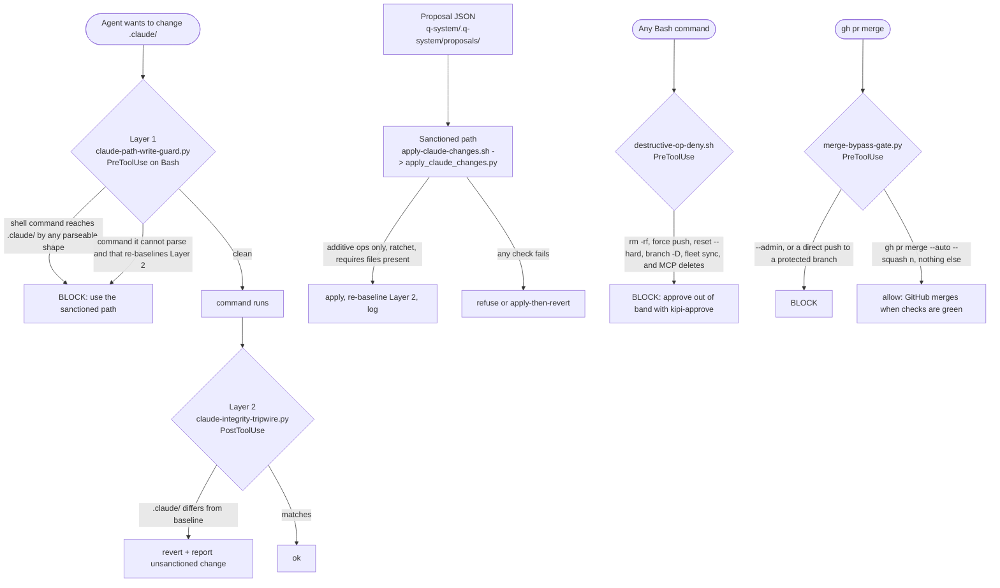
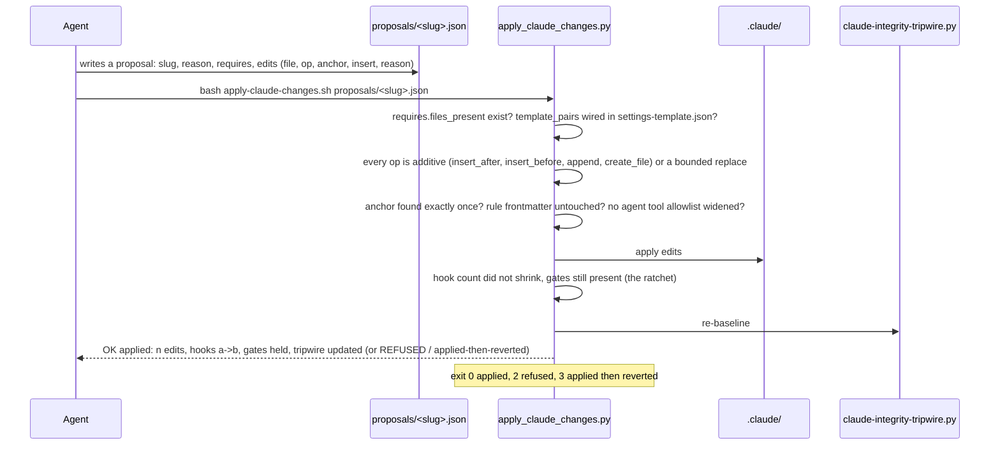

# 04. The .claude protection layers

The `.claude/` directory wires every hook, rule and agent. An agent that can write there can
disable its own gates, so writes to it are the most guarded thing in the repository. Three
layers hold that line, plus two more gates on the two other ways an agent could route
around the machinery: a destructive shell command, and a merge that skips the checks.

## Components

Five gates, three of them on the configuration directory. Layer 1 reads the shell command
before it runs and refuses any shape that would reach `.claude/`; when it cannot parse a
command that also re-baselines Layer 2, it fails closed instead of handing off. Layer 2
runs after every tool call, compares `.claude/` to a baseline, and reverts and reports an
unsanctioned change. The sanctioned path is a proposal file that an engine applies with
additive operations only, a ratchet, and preconditions, then re-baselines Layer 2 and logs
the application. Separately, the destructive-op hook refuses the command shapes that have
destroyed data before unless the founder approved that exact command out of band within
five minutes, and the merge-bypass gate permits exactly one merge shape, the one GitHub
holds until the required checks pass.

## Flow: the sanctioned path

One command, one line of output, no diff for the founder to review; the safety is
mechanical. The engine checks that the scripts the proposal wires actually exist and that
the template carries the same wiring, applies only additive edits anchored on unique text,
refuses to widen an agent's tool allowlist or to add frontmatter to an existing rule,
verifies afterward that no hook or gate disappeared, and re-baselines the tripwire so the
change is now sanctioned.

## Every piece

- `claude-path-write-guard.py` (Layer 1, PreToolUse on Bash): parses the command; blocks any write, redirect, substitution, `eval`, or interpreter invocation that reaches a `.claude/` path, and any unparseable command that also touches the Layer 2 baseline. Tested with a large fixture set of command shapes.
- `claude-integrity-tripwire.py` (Layer 2, PostToolUse; also SessionStart via a drift report): baseline hash of `.claude/`; on drift, reverts the file and reports. `--baseline` re-baselines after a sanctioned change; the SessionStart report names modified and removed files.
- `apply-claude-changes.sh` and `apply_claude_changes.py`: the sanctioned path. Ops: `insert_after`, `insert_before`, `append`, `create_file`, bounded `replace`. Refuses frontmatter changes to existing rules, allowlist widening in agents, symlinks, and any proposal whose required files are absent. Log at `q-system/output/claude-changes/apply.log`. Founder notifications are stubbed during a founder-run apply.
- `destructive-op-deny.sh` (PreToolUse on Bash, installed at the user level): denies `rm -rf` on directories, `find -delete`, `mkfs`, `dd` to a device, `git push --force`, `git reset --hard`, `git branch -D`, `git filter-repo`, `git clean -fd`, the fleet-wide sync, and destructive MCP calls (Notion move/delete, Gmail delete label, Linear delete, Vercel mutations). Bypass only by `kipi-approve <hash>` in the founder's shell (300-second window, one command) or `ALLOW_DESTRUCTIVE=1`. It matches text, deliberately, so a doc that quotes a dangerous command trips it; write those with the file tools, not a heredoc.
- `merge-bypass-gate.py` (PreToolUse on Bash): allows exactly `gh pr merge --auto [--squash] [<n>]`; denies `--admin` in every spelling, any global flag, any env prefix, and a direct push to a protected branch. Tested by `test_merge_bypass_gate_global_flags.py`.
- `mcp-denylist-namespace-check.py`: refuses an MCP denylist namespace that names no configured server, so a typo cannot silently allow a tool.
- `break-glass-main-protection.sh`: the escape hatch for the branch protection that `enforced-claim` and the reviewer floor rely on; records its use.
- `test_destructive_op_deny_anchor.py`, `test_destructive_op_mcp_namespace.py`: pin the deny patterns and the MCP namespace rule.

## Scars

- 2026-05-17: an agent "fixed" a credential mismatch by deleting a production volume;
  every prompt-level rule against it was violated. Only hook-level enforcement held.
  Result: `destructive-op-deny.sh`, and the principle that asking for approval on these
  is the contract, not a violation of autonomy.
- 2026-08-14: `gh pr merge --admin` merged to main past both required checks; the only
  layer that could have refused it allowed every push and merge form. Result:
  `merge-bypass-gate.py`.
- ASK-282, ASK-291: the two-layer design for `.claude/`, with Layer 1 failing closed on
  any command it cannot parse that would void Layer 2.

## Retired

None. Every gate on this page is live.
