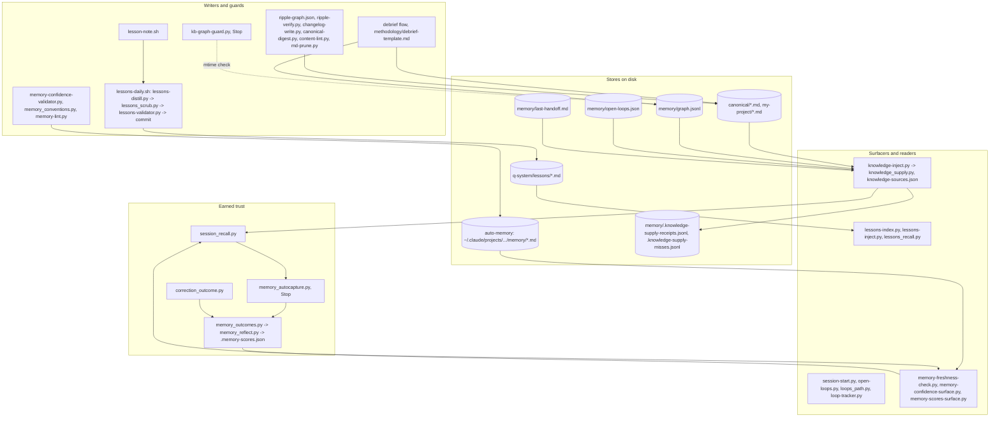

# 05. Knowledge and memory

What an instance knows lives in files, and this subsystem is the set of writers, guards,
surfacers and readers around those files. It has three stores with different rules (the
curated canonical layer, the per-instance memory, and the fleet-wide lessons corpus), a
trust system that grades auto-memories by whether they were ever used, and the knowledge
supply reader that puts instance facts in front of the model when a question names them.

## Components



Four groups. The stores: the curated files, the dated fact graph, the handoff and loop
ledger, the read-only lessons corpus, the per-user auto-memory, and the receipts the
reader writes. The writers and guards: the debrief flow writes canonical files and graph
triples; a Stop hook refuses to close a session whose entity files outgrew the graph;
the ripple graph and its verifier keep dependent canonical files consistent; the nightly
lessons job distills each instance's learnings, scrubs client data behind a fail-closed
gate, validates frontmatter and commits; the confidence validator refuses an auto-memory
without a valid trust header. The surfacers and readers: session start and the loop
surfacer inject continuity; the lessons trio injects titles at start, relevant bodies on
a question, and offers search on demand; the knowledge reader injects instance facts on
a question with a coverage line. Earned trust closes the loop: what was surfaced is
recorded per session, a Stop hook scores each surfaced memory useful or dead-end by
whether its file was opened, and a scoring engine turns outcomes into preferred, contested
or stale labels that the surfacers show next time.

## Flow: a question about a client

```mermaid
sequenceDiagram
    participant F as Founder
    participant KI as knowledge-inject.py
    participant KS as knowledge_supply.py
    participant M as Model
    participant SR as session_recall.py
    participant MA as memory_autocapture.py
    F->>KI: "what have we promised Dana Okafor"
    KI->>KS: supply(root, prompt, session_id)
    KS->>KS: find qroot; load knowledge-sources.json (instance override first)
    KS->>KS: build entity index from graph, relationships, commitments, meetings, loops, aliases
    KS->>KS: resolve entities (phrase match; single tokens through single_token_hit; first-name expansion)
    KS->>KS: classify: temporal_event / commitment / writing / capability / entity_lookup
    KS->>KS: for each declared source class: resolve, cap per entity, label status
    KS->>KS: assemble: pins first, fit to the rendered ceiling, dedupe per entity
    KS-->>KI: bundle + receipt (coverage FULL/PARTIAL, sources searched/absent, deadline, dropped entities)
    KS->>SR: record_surfaced(source files)
    KI-->>M: COVERAGE line, verbatim excerpts with path:line and KNOWN/STALE/CONFLICTING/UNVALIDATED
    M->>M: answers, opens src files when it matters
    M->>MA: Stop
    MA->>SR: read_and_clear(session)
    MA->>MA: useful if the source was opened this session, dead_end if never touched
    MA->>MO: record outcomes
```

The supply path end to end. The hook hands the question to the engine; the engine finds
the instance root, loads the manifest that declares which source classes each task class
needs, builds an entity index from every store, resolves the names in the question under
the single-token chokepoint, classifies the task, runs the resolvers per declared class
with a per-entity cap and a status label, assembles under the character ceiling with the
newest fact per entity pinned, and returns the bundle with a receipt naming every source
as searched, empty, unreadable or absent. The hook renders the coverage line first. The
same pass records what it surfaced so the Stop hook can score it later by whether the
model opened the file.

## Every piece

Canonical layer
- `canonical/*.md`, `my-project/*.md`: the curated truth and running state; consistency edges in `ripple-graph.json`.
- `ripple-verify.py`, `changelog-write.py`: after a canonical edit, verify the ripple targets were addressed; append a changelog entry and return targets.
- `canonical-digest.py`: deterministic structured digest of the canonical files (the MCP tool `kipi_canonical_digest` wraps the same parser).
- `content-lint.py`: markers, orphans and stale sections in canonical files.
- `md-prune.py`: archives oldest sections over a per-file line budget at SessionStart.
- `decision-origin-tag-lint.py`: page 07.

Graph
- `memory/graph.jsonl`: dated `{s,p,o,t,project}` triples, append-only, untracked; optional `src` and `alias_of` rows per the debrief template.
- `kb-graph-guard.py` (Stop): entity files newer than the graph triggers exit 2 once a day, then one Linear line and exit 0. Tested by `test_kb_graph_guard.py`.
- `ensure_instance_kb.py`: seeds the file fleet-wide.

Loops and handoff
- `open-loops.json` with `loops_path.py` (one place that knows where it lives) and `loop-tracker.py` (open, close, escalate, prune; also exposed as the `loop_*` MCP tools).
- `open-loops.py` (SessionStart): injects every open loop and the board staleness note.
- `open-loops-heartbeat.sh`: page 10.
- `last-handoff.md`: written by the handoff flow, read by `session-start.py`, linted by `handoff-provenance-lint.py` (page 07).

Lessons corpus
- `lessons-daily.sh` (launchd, and `kipi lessons-run`): `lessons-distill.py` turns each instance's RCAs and learning notes into HOW-only lessons, `lessons_scrub.py` removes client data and holds anything it cannot clear in `lesson-candidates/`, `lessons-validator.py` (PostToolUse) allows only the four frontmatter keys, then commit; `install-lessons-daily.sh` installs the job.
- `lesson-note.sh`: drop a non-failure learning into the intake.
- `lessons-index.py` (SessionStart), `lessons-inject.py` (UserPromptSubmit, IDF term overlap, top 3 bodies, 12,000-char ceiling), `lessons_recall.py` (on demand: search, similar, duplicates, stats; TF-IDF cosine over the whole corpus).
- `route-overrides-to-learn.py`: routes engagement overrides into the learn-from-correction skill's intake.

Auto-memory trust
- `memory_conventions.py`, `memory-confidence-validator.py` (PostToolUse): the frontmatter vocabulary and the write-side gate on confidence range and provenance value.
- `memory-freshness-check.py`, `memory-confidence-surface.py`, `memory-scores-surface.py` (SessionStart): surface fast-decay, low-trust, and preferred/contested/stale memories; the scores surface annotates the index lines.
- `session_recall.py`: session-keyed record of what was surfaced, single writer, locked.
- `memory_autocapture.py` (Stop): scores useful or dead_end from transcript reads; gated to allowlisted instances.
- `memory_outcomes.py`, `memory_reflect.py`: the outcome event log and the earned-trust scoring engine (corroboration gate, signed time decay, contested bucket).
- `correction_outcome.py`: records a `corrected` outcome from the learn-from-correction path.
- `memory-lint.py`: report-only hygiene sweep.

Knowledge supply
- `knowledge-inject.py` (UserPromptSubmit) and `knowledge_supply.py`: the reader; manifest `q-system/.q-system/knowledge-sources.json` (instance override under `.q-system/data/`); receipts and misses ledgers untracked under `memory/`; kill switch `KNOWLEDGE_INJECT_OFF=1`; deadline `KNOWLEDGE_SUPPLY_DEADLINE_S`. Tested by `test_knowledge_supply.py` (55 cases). Status labels come from `provenance-vocabulary.json` (page 07).
- `system_manifest.py`: declares what a data path is made of, so the grounding guard can require every member be read; also the capability index the reader uses for "how does X work" questions.

## Scars

- 2026-08-11: 122 lessons, 20 surfaced, 102 permanently invisible behind a recency cap;
  the corpus was writing duplicates it could not see. Result: no cap, and recall.
- 2026-08-29: 155 titles handed to a session that opened none. Result: bodies injected on
  the question, not titles at start.
- 2026-09-04: the graph had a freshness guard and zero readers; a client question got 0
  bytes of instance facts. Result: the knowledge supply reader with receipts.
- 2026-07-28: an auto-memory guess and a founder-stated fact were indistinguishable at
  recall. Result: confidence and provenance headers with a validator.

## Retired

- `memory/working`, `memory/weekly`, `memory/monthly`: documented time layers with no
  writer, no promoter and no reader; the lifecycle prose lived in a file nothing loads
  and the review steps belonged to the retired morning pipeline (sp-076fac26).
- `sources/graph-kb.yaml` in the MCP server: a harvest source for the graph whose data
  directory resolves nowhere; the reader does not use it.
