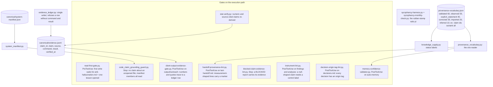
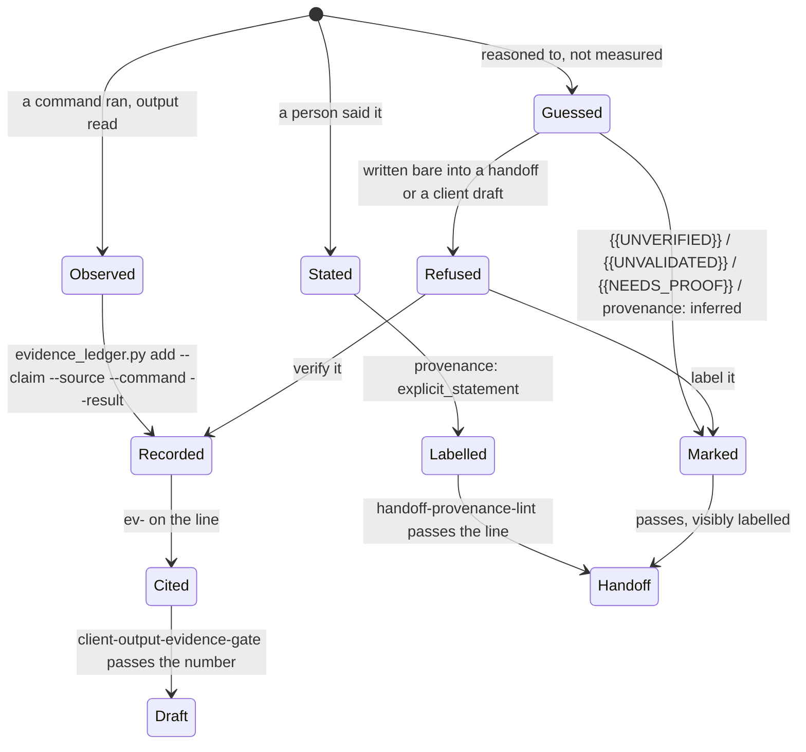

# 07. Evidence and provenance

A conclusion delivered in chat is a shipped artifact: it steers the next draft. So kipi
stores evidence first and derives conclusions from it, labels every claim with how it was
known, and runs gates that refuse a number without a source, an inherited claim without a
provenance marker, a report that says "blocked" without proof, and an answer that asserts
something about a file the session never opened. One vocabulary of provenance values, in
one table, is read by every validator.

## Components

One vocabulary and one ledger feed every gate. The vocabulary ranks how much a marker
proves; the two lints that read it and the knowledge reader all import the same module,
so the ranking rule exists in one place. The ledger is the durable store of verified facts,
with a single writer that refuses a row lacking the command and its result, so an inference
cannot be stored in the shape of a measurement. The system manifest declares what a data
path is made of, so the grounding guard can require every member be read. Nine gates sit on
the execution path: before the first write, after writes to specific paths, and at Stop on
the answer itself. The sycophancy harness and its monthly check measure how often the
system's own recommendations pass unexamined.

## Flow: a claim's life

Every claim starts as observed, stated, or guessed. An observed claim goes into the ledger
with its command and result and earns an id that outranks every other marker. A stated
claim carries the statement marker. A guess is allowed, and labelling it is the correct
move, not a lesser one; the defect is a guess written in the shape of a measurement. The
gates refuse that shape and offer two ways out: verify it, or label it. A per-file bypass
marker exists for each gate, one per gate, no stacking, as the last resort.

## Every piece

Vocabulary and ledger
- `provenance-vocabulary.json`: the table. `provenance_vocabulary.py`: the one reader; run it to print accepted forms and ranks.
- `evidence_ledger.py`: `add`, `check`; single writer of `canonical/evidence.jsonl`.
- `system_manifest.py`: `check`, `members`, `mentions`; the declared composition of each data path.
- `stat-verify.py`: re-derives numeric and source-cited claims deterministically.
- `stat-registry-extract.py`: the canonical statistics registry (page 06).

Gates
- `read-first-gate.py` (PreToolUse, first Write/Edit): an open counts from any tool. Fails open on missing input. Known limit (sp-6ff00dd5): a subagent that did open both files can still be blocked on a gated target.
- `code_claim_grounding_guard.py` (Stop): check one, a repo file claimed but never opened; check two, a manifest subsystem whose members were not all read. Bypass marker `grounding-guard-skip`.
- `client-output-evidence-gate.py` (PostToolUse on `output/outreach/`): a number of two or more digits, or a quoted span of four or more words, must trace to a ledger row. Bypass `evidence-gate-skip`.
- `handoff-provenance-lint.py` (PostToolUse on `memory/last-handoff.md`): a measurement-shaped line needs `[verified: ...]`, an `ev-` id, or an unverified marker. Bypass `handoff-provenance-skip`.
- `blocked-claim-evidence-lint.py` (Stop): a report saying "blocked" must carry the evidence that it is.
- `instrument-lint.py` (PostToolUse on investigation findings and output analyses): a null-shaped claim ("nothing found") needs a control label; files dated before 2026-09-04 are exempt. Tested by `test_instrument_lint.py`.
- `decision-origin-tag-lint.py` (PostToolUse on `decisions.md`): `[USER-DIRECTED]`, `[CLAUDE-RECOMMENDED -> APPROVED|MODIFIED|REJECTED]`, `[SYSTEM-INFERRED]`, `[COUNCIL-DEBATED]`.
- `memory-confidence-validator.py` (PostToolUse on auto-memory): page 05.
- `client-name-guard.py` (pre-commit, commit-msg): a client name never reaches the public repository's staged content or commit message; the intent marker `client-name-guard-skip: <reason>` records a deliberate exception.

Sycophancy
- `sycophancy-harness.py`: independent verification of a debrief's sycophancy audit; the harness wins over the audit agent when they disagree.
- `sycophancy-monthly-check.py` (SessionStart, first of the month): pi = approved / (approved + modified + rejected) over 30 days; at or above 0.7 flags high rubber-stamp risk.
- `founder-judge-calibration.py`: page 06.

Honest boundaries these gates state in their own headers
- A false claim carrying no numbers and no quotes passes the output gates untouched.
- An incomplete manifest certifies incomplete reading.
- The gates prove a file was opened, not that it was read carefully or applied.
- `[verified: I checked]` passes and proves nothing; the markers remove ambiguity, not the possibility of lying.

## Scars

- 2026-07-28: a read-only trace produced six confident conclusions, all reversed later in
  the same session by evidence available from the first minute; one reached a client
  draft. Measurements survived recomputation, inferences did not. Result: the ledger, the
  four gates, and the provenance vocabulary.
- 2026-07-28 to 07-31: two validators shipped two different provenance vocabularies three
  days apart, invisibly, because their file scopes differed. Result: one table, one reader.
- 2026-09-04: null-shaped findings ("no evidence of X") with no control. Result:
  `instrument-lint.py`.

## Retired

None. The `{{NEEDS_VALIDATION}}` marker form still appears in older canonical files and is
read as unvalidated by the knowledge reader alongside the current forms.
