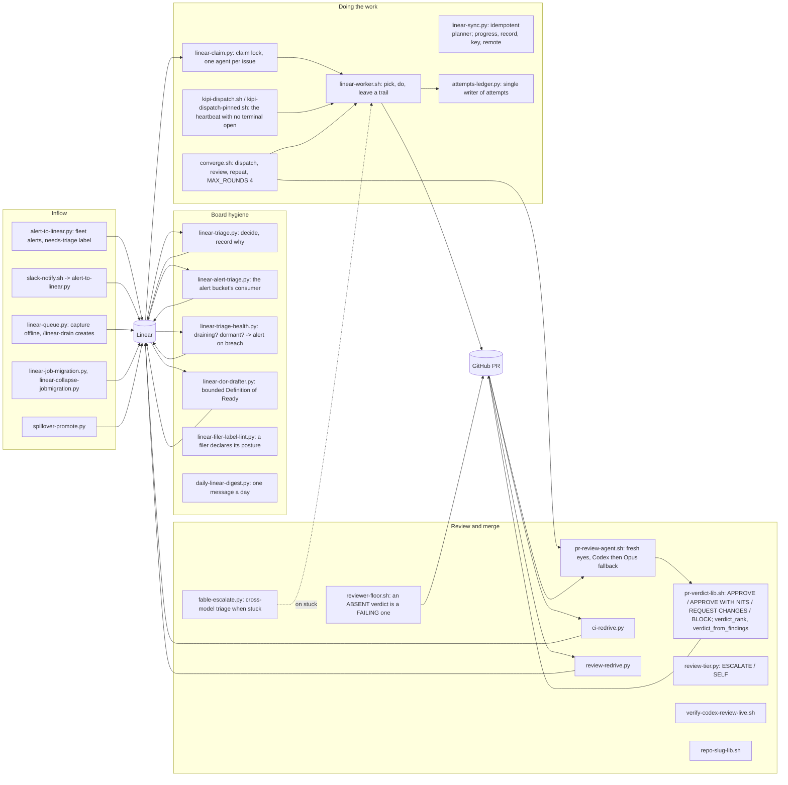

# 09. Linear and the autonomous worker

Work is recorded in Linear or it did not happen. This subsystem files issues (from
detectors and from people), triages them, drafts their readiness, claims and works them,
opens and reviews pull requests, drives each to an approved merge with no human in the
loop, and consumes every red state by machine. The founder is never the next actor.

## Components



Inflow, hygiene, work, review. Alerts and offline captures become issues, always labelled
so a machine-filed issue is distinguishable from a human one. Hygiene keeps the board from
only growing: a triage pass records a decision on every open issue, an alert-bucket
consumer drains what the alert path files, a health check alerts when the queue stops
draining, a drafter writes a bounded Definition of Ready onto issues that lack one, and a
digest reports once a day. Work is claimed under a lock, done by the worker (on a
scheduled heartbeat with no terminal open, or driven issue-by-issue by the converge loop),
and every attempt is recorded by one writer. Review is a fresh-eyes agent whose verdict
vocabulary and severity floor live in one shared library; an absent verdict is a failing
status, never a passing one. Red CI and a refused review each have a machine consumer,
and a stuck worker gets a cross-model triage.

## Flow: converge one issue

```mermaid
sequenceDiagram
    participant O as Operator or dispatcher
    participant C as converge.sh
    participant W as linear-worker.sh
    participant PR as GitHub
    participant R as pr-review-agent.sh
    participant L as Linear
    O->>C: kipi converge ASK-nnn
    loop up to MAX_ROUNDS (4)
        C->>W: dispatch the worker on the issue
        W->>L: claim (linear-claim.py); refuse if another session holds it
        W->>W: repo-preflight.sh; position tree on the PR head
        W->>PR: commits naming the issue; open or update the PR
        W->>L: progress note with evidence (linear-sync.py progress)
        C->>R: review --post
        R->>R: codex exec bounded; on failure or timeout, Opus fallback marked DEGRADED
        R->>PR: comment + commit status kipi/reviewer-approved
        alt APPROVE or APPROVE WITH NITS
            C->>PR: gh pr merge --auto --squash (the only shape merge-bypass-gate permits)
            PR-->>L: closed on merge
        else REQUEST CHANGES or BLOCK
            C->>W: next round with the findings
        end
    end
    C-->>O: converged, or the round cap with the last verdict; attempts-ledger.py records each
```

The loop has a coded turn cap (`MAX_ROUNDS`), a wall clock around each reviewer run, and
an error threshold, the three exits an autonomous loop must own. The verdict is a commit
status, so GitHub's required checks make the merge decision and `merge-bypass-gate.py`
refuses every other route to main. Pushing nit fixes
after an approval resets the floor on the new head and costs a full round, so nits are
captured as spillover and fixed after merge.

## Every piece

Inflow
- `alert-to-linear.py`: files a fleet alert as a Linear issue with `needs-triage`; repeats do not re-mark. `slack-notify.sh` is the one alert sink and routes here (page 10).
- `linear-queue.py`: captures an intent offline (never touches the network); `/linear-drain` (kipi-core command) creates the queued projects and issues.
- `linear-job-migration.py`, `linear-collapse-jobmigration.py`: one tracked issue per scheduled job, and the collapse of the duplicate family that produced.
- `spillover-promote.py`: page 08.
- `linear-filer-label-lint.py` (PostToolUse): a script that constructs an issue must reference `needs-triage` or declare `human-in-the-loop` with a reason.

Hygiene
- `linear-triage.py`: the senior-engineer pass; reads every open issue, decides, writes the verdict and the why on the issue. Volume from one detector is a signal about the detector.
- `linear-alert-triage.py` (`kipi alert-triage`): the consumer between alert-to-linear and the worker.
- `linear-triage-health.py` (launchd): unrouted count, `needs-triage` depth, oldest untouched, dormancy past 75 days; flags dormant with a comment, never closes; alerts on a breach, excluding its own tickets from its counts.
- `linear-dor-drafter.py` (`kipi dor`, launchd at 03:00 with `--limit 8 --apply`): drafts a Definition of Ready onto issues that lack one, bounded per run.
- `daily-linear-digest.py` (launchd at 16:00): what closed, what opened, what could not be worked, one message.

Work
- `linear-sync.py`: `plan`, `create` (dry unless `--apply`), `record`, `key`, `progress`, `label`, `comments`, `remote`, `status`; idempotent by a dedup key per repo and capability.
- `linear-claim.py`: `claim`, `release`, `status`; refuses an issue another session holds.
- `linear-worker.sh` (`kipi work`): bounded runs, attempts and conflict-round and drift-round counters, claim-page-once, auto-merge arming, tree positioning on the PR head. Reads only `backlog` and `unstarted` states.
- `kipi-dispatch.sh`, `kipi-dispatch-pinned.sh`: the heartbeat that runs the worker from a checkout dedicated to it and pinned to origin main.
- `converge.sh` (`kipi converge`): the per-issue loop above.
- `attempts-ledger.py`: the single writer of `linear-worker-attempts.json`.
- `repo-preflight.sh`, `repo-slug-lib.sh`: whether a dispatcher may enter a repo, and the one place a GitHub owner/repo slug is derived.

Review and merge
- `pr-review-agent.sh` (`kipi review`): detached review tree per PR, Codex bounded at 2,400 seconds with the Opus fallback on failure, verdict record at `~/.config/kipi/pr-reviews/`, comment and commit status only with `--post`. Every post call sits inside the `--post` branch: without it the verdict record is written and nothing is posted.
- `pr-verdict-lib.sh`: shared verdict semantics, severity floor, `verdict_from_findings`, `verdict_rank`, `verdict_from_record`.
- `reviewer-floor.sh` (CI check `reviewer-floor`): an absent verdict at this head is a failing `kipi/reviewer-approved`.
- `review-tier.py`: deterministic ESCALATE or SELF classifier for review rounds.
- `ci-redrive.py`, `review-redrive.py`: the machine consumers for red CI and a refused review; retry what is retryable, file a ticket when they cannot; their founder-directed messages are a recorded spillover (sp-5d92a01d).
- `fable-escalate.py`: three token-guard refusals (exact retry, edit spiral, volume ceiling) request a fresh-session triage of the transcript tail; DIAGNOSIS, STOP, NEXT, REFUTE; capped at two per session, then one ticket; off switch `KIPI_FABLE_ESCALATION=0`; ledger under `q-system/output/fable-escalations/`.
- `verify-codex-review-live.sh`: a real billed probe of the Codex reviewer, macOS-only by design.
- `merge-bypass-gate.py`: page 04.

## Scars

- 2026-08-16: 229 issues with no project; inflow automated, outflow manual. Result: the triage pass, the health check, and the rule that the founder is never the next actor.
- PR #297: seven review rounds on one finding class. Result: the round cap, and the rule that a repeated class means the fix shape was wrong.
- 2026-09-03: two approvals lost to a review run without `--post`. Result: the note in the handoff and this page.
- ASK-311: same-model retries re-run the same reasoning distribution. Result: cross-model escalation, detached so the block is never traded for the triage.

## Retired

- `linear-collapse-jobmigration.py` ran once to collapse a duplicate family; kept as the record of how.
