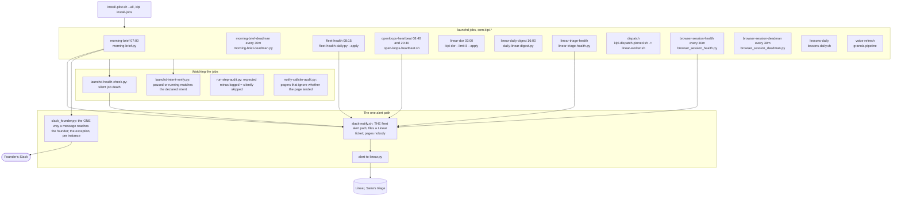

# 10. Background jobs and health

Kipi runs without a terminal open. Scheduled jobs on the founder's machine send the morning
brief, drain the Linear loop, sweep open loops across the fleet, check every instance's
health, draft readiness, digest the day and learn from it. Every job is watched by a
watchdog that notices silent death, every alert goes to one sink that files a ticket for an
agent, and the two jobs that matter most have a deadman that says so when they did not run.

## Components



Twelve scheduled jobs, four watchers, one alert path. The morning brief is the only job
whose output goes to the founder; its deadman says if it did not land by the deadline.
Fleet health runs every detector across every instance and each detector must detect,
act and feed a lesson. The open-loops heartbeat sweeps every registered instance twice a
day and pings only on a meaningful change. The dispatch job runs the worker from a pinned
checkout. The Linear jobs draft readiness at night, digest at four, and check the queue's
health. The browser pair probes every declared research surface and a deadman covers the
prober. Two watchers cover the jobs themselves: one notices a job that stopped running,
one verifies each job's paused or running state matches a declared intent, so a paused
job is a decision and not rot. Every engineering alert goes through one script that files
a Linear ticket in the agent's queue and pages nobody; the founder-facing channel is a
separate script, wired per instance on request.

## Flow: a morning

```mermaid
sequenceDiagram
    participant LD as launchd
    participant DOR as linear-dor (03:00)
    participant MB as morning-brief (07:00)
    participant DM as morning-brief-deadman (every 30m)
    participant FH as fleet-health (08:15)
    participant OL as openloops-heartbeat (08:40)
    participant SN as slack-notify.sh
    participant F as Founder
    LD->>DOR: kipi dor --limit 8 --apply
    DOR->>DOR: draft a Definition of Ready onto up to 8 issues
    LD->>MB: morning-brief.py
    MB->>MB: calendar, mail needing an answer, the consulting board; a section it cannot read says COULD NOT READ
    MB->>F: one Slack message (slack_founder.py)
    MB->>SN: what is owed and which overnight jobs failed (engineering signal, not the founder's)
    LD->>DM: every 30 minutes
    DM->>DM: brief landed by 09:00? else say so
    LD->>FH: fleet-health-daily.py --apply
    FH->>FH: every detector across every instance: detect, act, feed lessons
    FH->>SN: one summary line on state change
    LD->>OL: open-loops-heartbeat.sh
    OL->>OL: sweep every instance's ledger; ping only on a meaningful change; merge own PRs under the autonomy contract
    OL->>SN: one line if anything changed
    SN->>SN: alert-to-linear.py files a ticket with needs-triage
```

The founder sees one message, the brief, and only the parts of it that are the founder's
to act on. Everything else that fires in the morning is engineering signal and lands in
the agent's queue. A section the brief could not read says so in those words, never
"nothing"; a missing brief is announced by a different job from the one that failed.

## Every piece

Jobs
- `morning-brief.py` (07:00): calendar, mail needing an answer, the consulting board; COULD NOT READ per section; the retired nine-phase pipeline it replaced is on page 14.
- `morning-brief-deadman.py` (every 30 min): a different job from the brief, so a crashed brief is still reported.
- `fleet-health-daily.py` (08:15, `kipi health`): every detector must detect, act and feed a lesson; one summary line, never one ping per finding.
- `open-loops-heartbeat.sh` (08:40, 20:40): sweeps every registered instance's loop ledger, wraps each model call in a 1,800-second timeout, escalates by age, merges its own PRs under the autonomy contract.
- `kipi-dispatch.sh` via `kipi-dispatch-pinned.sh` (dispatch): the worker heartbeat from a dedicated checkout pinned to origin main.
- `linear-dor-drafter.py` (03:00), `daily-linear-digest.py` (16:00), `linear-triage-health.py`: page 09.
- `browser_session_health.py`, `browser_session_deadman.py` (every 30 min): page 13.
- `com.kipi.lessons-daily` (`lessons-daily.sh`, nightly, `kipi lessons-run`): page 05. `lessons_streak.py` is the single writer of the propagation streak file and its escalations ledger; `lessons_notion_sync.py` mirrors the corpus into the founder's Notion lessons database.
- `com.kipi.lessons-drift` (`lessons-drift-report.py`, weekly): what a declared hub instance has that the skeleton lacks.
- `com.kipi.weekly-improve` (`weekly-improve.sh` -> `weekly-improve.py`, weekly): the one registered trigger for the learning lane; the weekly pass over the friction ledger that `friction-note.sh` appends to, plus the draft-versus-sent stage that `draft-vs-sent.py` produces; `trigger-inventory.py` derives which learning stages actually have a trigger from the tree; `decision-corpus-cost.py` measures what loading the decision corpus would cost per turn.
- `com.kipi.morning-inbox` (`morning-brief.py --inbox-only`, hourly 08:05 to 19:05): the inbox section alone, through the day. `consulting_board.py` paints the consulting half of the brief (clients, the GTM move, the inbox), `board_rows.py` writes its rows, `notion_board.py` renders the Notion morning board, `groupme_inbox.py` lists GroupMe conversations waiting on the founder, `unknown_terms.py` builds the "terms I do not know" section, and `engineering_route.py` routes every engineering signal the brief collects to the agent's Linear triage, never to the founder.
- `com.kipi.voice-refresh` (monthly, from `automation/` at the repo root, where instance automation lives so the fleet sync cannot clobber it): `voice_refresh.py` wraps the Granola synthesize and fingerprint scripts of page 06 on a corpus the interactive `/voice-refresh` command already harvested; `voice-refresh-nudge.sh` is the monthly nudge that the refresh is due, routed through `slack-notify.sh` and never osascript; `install-voice-refresh.sh` renders and loads the plist. Tests: `test_voice_refresh.py`, `test_voice_refresh_schedule.py`, `test_voice_refresh_command.py`.
- Job labels, spelled out for the record: `com.kipi.morning-brief`, `com.kipi.morning-brief-deadman`, `com.kipi.morning-inbox`, `com.kipi.fleet-health`, `com.kipi.openloops-heartbeat`, `com.kipi.linear-dor`, `com.kipi.linear-daily-digest`, `com.kipi.linear-triage-health`, `com.kipi.dispatch`, `com.kipi.browser-session-health`, `com.kipi.browser-session-deadman`, `com.kipi.lessons-daily`, `com.kipi.lessons-drift`, `com.kipi.weekly-improve`, `com.kipi.voice-refresh`. Five of the fifteen templates (`dispatch`, `linear-triage-health`, `lessons-daily`, `lessons-drift`, `weekly-improve`) do not parse as plists in the tree; the installer substitutes a placeholder before loading, and a parse test is captured as sp-b4cbe0e2.
- `install-plist.sh` (`kipi install-jobs`): installs every committed template into `~/Library/LaunchAgents`, substituting the repo path; macOS-only by design. `init-bus-day.sh`: the bus-era day initializer, retired with the pipeline.

Watchers
- `launchd-health-check.py`: watches the jobs and surfaces silent death; also the morning-brief timing check.
- `launchd-intent-verify.py`: every job's paused or running state matches a declared intent file, so a pause is recorded with a reason and a deadline.
- `run-step-audit.py`: generic step-completion auditor, expected minus logged; `audit-morning.py` is the morning-specific one from the pipeline era.
- `notify-callsite-audit.py`: finds callers that page and then ignore whether the page landed; `slack-notify.sh` records `notify_attempted`, `notify_exit`, `notify_channel_configured`, `notify_delivered` separately for that reason.
- `collection-gate.py`: skip or collect per data source, from the harvest era.

Alert path
- `slack-notify.sh`: THE fleet alert path. Founder-directed 2026-08-10: "I dont want to see any of these. Any of the ones that need attention should go to Sana." Files a Linear ticket via `alert-to-linear.py`; silent no-op if unconfigured, still exit 0, which is why callers record delivery separately. Also a PostToolUse hook so a gate can emit on state change.
- `slack_founder.py`: the one way anything puts a message in front of the founder; the exception, wired per instance, never a default a feature ships with.
- `test-slack-notify-label.sh`: pins the label on the ticket it files.

## Scars

- 2026-04: the 37-agent morning pipeline died silently on two renamed MCP tool names and stayed dead for weeks. Result: a deterministic brief, a deadman, and a watchdog on every job.
- The income scanners broke silently for six days when the updater deleted their scripts from a synced subtree. Result: instance automation lives at the repo root, and `instance-automation-guard.py` blocks the other placement.
- 2026-08-01: a test drove a worker into its misconfigured branch, reached the real alert script, and paged the founder's phone twice while reporting green. Result: the notifier stub rule in the discipline lint and the delivery fields on every page.
- 2026-08-18: a feature shipped against a stale description of the alert path and its "founder page" landed in the agent's queue. Result: the rule doc rewritten to match the script.

## Retired

- The nine-phase morning orchestrator and its agents, bus and gates (RULE-2026-08-30-A): page 14.
- `com.kipi.fractional-cxo` and the story-podcast schedules, killed 2026-08-01; the podcast generation itself was left running by decision.
