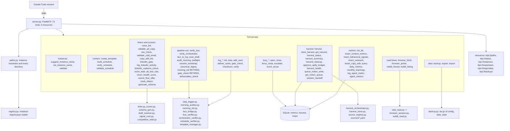

# 11. The MCP server

The kipi MCP server gives a Claude Code session deterministic tools: linters and scorers
that return the same answer every time, logging and loop tracking that persist to disk,
harvest and metrics stores in SQLite, and instance-aware path resolution so a session in
one project can never read another project's files. It is a Python package inside the
kipi-core plugin, run by Claude Code from the marketplace clone, not from this repository.

## Components



One server, ten tool groups, six resources, three SQLite stores. Every tool goes through
the paths module, which decides which instance the process serves and where its
directories are. The pipeline-era group is kept for the two tools still called by hand
(`kipi_preflight`, `kipi_canonical_digest`) and marks the rest retired in their own
docstrings. The linters and scorers are stateless functions over their input. The metrics,
harvest and loop groups persist to SQLite under the plugin's data directory. The read lanes
delegate to the two scripts in the repo that touch a browser or the network.

## Flow: instance resolution and one tool call

```mermaid
sequenceDiagram
    participant CC as Claude Code
    participant S as server.py
    participant P as paths.py
    participant R as registry.py
    participant T as a tool
    CC->>S: start (uv --directory <marketplace clone>/kipi-mcp run kipi-mcp)
    S->>P: KipiPaths()
    P->>P: base = KIPI_PLUGIN_DATA or ~/.kipi-system
    P->>P: instance = explicit arg, else KIPI_INSTANCE, else CLAUDE_PROJECT_DIR matched against the registry, else the shared active-instance marker, else default
    P->>R: registry rows; refuse on duplicate names or duplicate paths
    P-->>S: canonical_dir, my_project_dir, memory_dir, output_dir, bus_dir, metrics_db, harvest_db, sources_dir
    CC->>S: kipi_voice_lint(text)
    S->>T: linter.py
    T-->>S: JSON findings
    S-->>CC: result, or ToolError with the message
```

The resolution order is the security property. The explicit argument wins, then a
per-process environment variable, then the project directory matched against the
registry, and only last the shared marker file that every project on the machine can see.
Reversing that order once let a session in one project read another project's canonical
tree, and a duplicate registry path once let the server bind to whichever row came first;
both are refused now. Every tool call wraps its error into a tool error with the message,
never a silent empty result.

## Every piece

Server and paths
- `server.py`: the tool and resource definitions; the plugin description lists the tool groups so they are discoverable.
- `paths.py`: `KipiPaths`, `_resolve_instance`, `_instance_from_project_dir`, `_state_root`, every `*_dir` and `*_db` property; `ensure_dirs` creates the memory time-layer directories (page 14).
- `registry.py`: reads the registry; tolerates the older shape without `excluded`.

Tools by group (names are the MCP tool names)
- Instances: `kipi_suggest_instance_name`, `kipi_set_instance_name`, `kipi_validate`.
- Content: `kipi_create_template`, `kipi_build_schedule`, `kipi_verify_schedule`, `kipi_validate_schedule` (`template_manager.py`, `schedule_verifier.py`).
- Pipeline era: `kipi_verify_bus`, `kipi_verify_orchestrator`, `kipi_bus_to_log`, `kipi_scan_draft`, `kipi_audit_morning`, `kipi_preflight`, `kipi_session_bootstrap`, `kipi_canonical_digest`, `kipi_deliverables_check`; `kipi_morning_init` and `kipi_gate_check` are RETIRED and say so (`bus_verifier.py`, `orchestrator_verifier.py`, `bus_bridge.py`, `draft_scanner.py`, `morning_auditor.py`, `morning_init.py`).
- Metrics: `kipi_init_db`, `kipi_insert_content_metrics`, `kipi_insert_behavioral_signals`, `kipi_insert_outreach`, `kipi_insert_copy_edit`, `kipi_query`, `kipi_daily_metrics`, `kipi_monthly_learnings`, `kipi_log_agent_metric`, `kipi_agent_metrics` (`metrics_store.py`; tables content_performance, behavioral_signals, outreach_log, copy_edits, daily_metrics, agent_metrics, ab_tests, ab_assignments, linkedin_activity).
- Linters and scorers: `kipi_voice_lint`, `kipi_validate_ad_copy`, `kipi_seo_check`, `kipi_validate_cold_email`, `kipi_copy_edit_lint`, `kipi_linkedin_gate`, `kipi_log_linkedin_activity`, `kipi_linkedin_cadence_check`, `kipi_score_lead`, `kipi_ab_test_calc`, `kipi_churn_health_score`, `kipi_cancel_flow_offer`, `kipi_crack_detect`, `kipi_generate_schema` (`linter.py`, `scorer.py`, `schema_gen.py`, `signal_core.py`, `competitive_intel.py`).
- Harvest: `kipi_harvest`, `kipi_store_harvest`, `kipi_get_harvest`, `kipi_harvest_status`, `kipi_harvest_summary`, `kipi_harvest_cleanup`, `kipi_approve_apify_budget`, `kipi_harvest_health`, `kipi_queue_notion_write`, `kipi_get_notion_queue`, `kipi_session_handoff` (`harvest_orchestrator.py`, `harvest_store.py`, `source_registry.py`, `sources/*.yaml`; tables harvest_runs, harvest_records, harvest_bodies, source_runs, source_cursors, apify_budget, notion_write_queue, session_handoffs). Fed by the retired pipeline; the sources remain declared.
- Read lanes: `kipi_browser_fetch`, `kipi_browser_probe`, `kipi_reddit_thread`, `kipi_reddit_listing` (`web_read.py`, page 13).
- Logging: `log_init`, `log_step`, `log_add_card`, `log_deliver_cards`, `log_gate_check`, `log_checksum`, `log_verify` (`step_logger.py`; the repo's `log-step.py` is the CLI form).
- Loops: `loop_open`, `loop_close`, `loop_force_close`, `loop_escalate`, `loop_touch`, `loop_prune` (`loop_tracker.py`, table loops; the repo's `loop-tracker.py` is the CLI form).
- Data: `kipi_backup`, `kipi_export`, `kipi_import` (`backup.py`; `git_ops.py` for the git-aware parts).
- Resources: `kipi://paths`, `kipi://status`, `kipi://instances`, `kipi://loops/open`, `kipi://loops/stats`, `kipi://backups`.
- Repo-side CLI twins for the stores: `db-init.py`, `db-query.py`, `monthly-learnings.py` under `q-system/.q-system/data/`.

Load path
- Runs from `~/.claude/plugins/marketplaces/kipi/`, version-keyed cache under `~/.claude/plugins/cache/kipi/kipi-core/<version>/`, pinned per session. A change is live only after merge, marketplace refresh, a version bump (`plugin-version-bump-check.py`) and a Claude Code restart; `runtime-plugin-freshness.py` fails when the running copy is older than the merged one.
- `kipi dev` loads the plugins from disk for development.

## Scars

- PR #240: the fix meant to prevent instance leaks introduced one, by consulting the project directory only after the shared marker. Result: the resolution order above, with the marker last.
- Duplicate registry paths let the server bind to the first row. Result: refuse on ambiguity.
- 2026-08-22: a branch fix was invisible to the live tool because the clone tracks main and the cache is version-pinned. Result: the freshness check and the load-path rule in the definition of done.

## Retired

- `kipi_morning_init`, `kipi_gate_check`: the nine-phase pipeline's entry and phase gate; still registered, marked RETIRED in their docstrings, and `morning_init` still creates a bus directory nothing has read since 2026-07-29.
- `sources/graph-kb.yaml`: page 05.
- `kipi_set_instance_name`'s shared marker: the last-resort fallback, kept for older instances.
