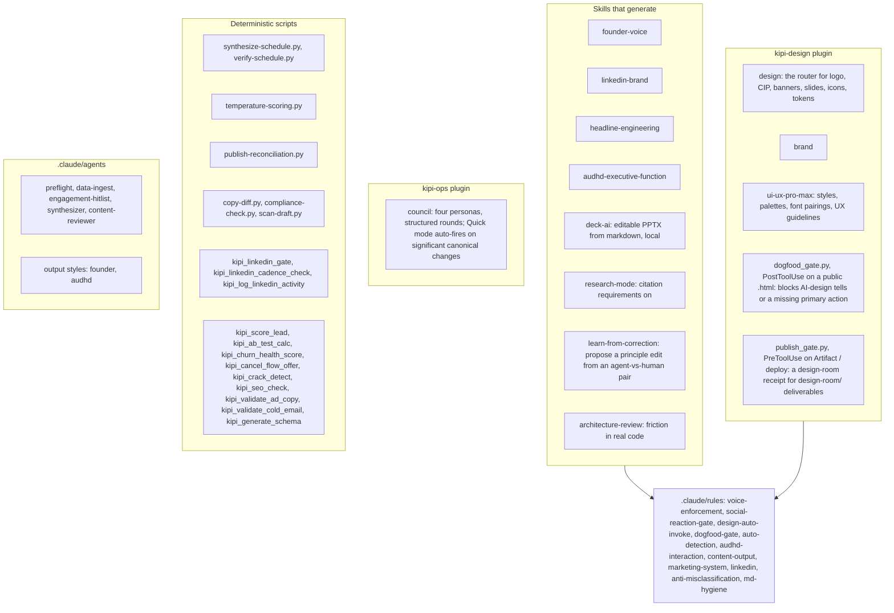
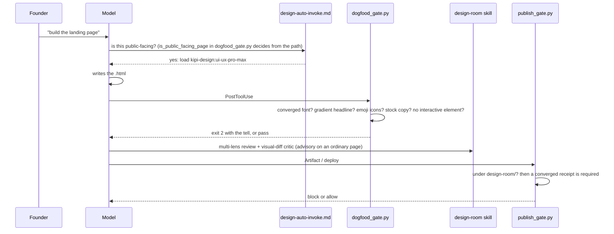

# 12. Content and GTM tooling

The go-to-market half of kipi: the skills that shape content and decks, the two design
gate scripts (`dogfood_gate.py`, `publish_gate.py`) that refuse a public page carrying the
tells the founder's own product catches, the deterministic schedule and scoring scripts
left from the morning pipeline, and the council that argues a strategy change before a
canonical file moves. Voice itself is page 06; this page is what the voice is applied to.

## Components

Four kinds of piece. Skills are instruction sets the model loads when a rule or a
description triggers them: voice, channel formats, headline patterns, AUDHD actionability,
deck generation, research citations, learning from a correction, and architecture
review. The design plugin routes design work and carries two gates: one blocks a public
page that shows the design tells the founder's own product exists to catch, one requires
a design-room receipt before a design-room deliverable is published. The ops plugin holds
the council, a four-persona debate that auto-fires in quick mode when a canonical file
would change by more than five lines. The deterministic scripts and MCP tools score,
verify and reconcile without a model call. The five custom agents and two output styles
are the pipeline-era roles and the two response registers.

## Flow: a public page ships

The path decides whether a page is public; `is_public_facing_page` in `dogfood_gate.py`
errs toward internal so a false block on a founder-only dashboard never gets the gate
switched off. A public page that fails the static tell check is refused by
`dogfood_gate.py` at write time. The design-room review is strongly wanted and advisory on
an ordinary page; `publish_gate.py` requires a receipt only for a deliverable that lives
under a design-room directory. That narrowness is documented on purpose: a
machine-required receipt on every public page in the fleet would be a new gate with a
fleet-wide blast radius, and it earns its own issue.

## Every piece

Skills (kipi-core unless noted)
- `founder-voice`, `linkedin-brand`, `headline-engineering`, `audhd-executive-function`: page 06 for the voice half; the AUDHD skill's actionability rules (copy-paste, click, check off) apply to everything the founder acts on and are the deterministic slice `audhd-lint.py` checks.
- `deck-ai`: editable PPTX from markdown, local, no subscription.
- `research-mode`: toggles citation requirements and source grounding (page 13).
- `learn-from-correction`: proposes a principle edit to a skill or persona file from an (agent output, human output) pair; `route-overrides-to-learn.py` feeds it.
- `architecture-review`: shallow modules, tight coupling, untested seams in real code.
- kipi-design: `design` (router), `brand`, `ui-ux-pro-max`. kipi-ops: `council`.
- prd-os: `prd-os`, `fable-discipline` (page 08).

Gates
- `dogfood_gate.py` (kipi-design, PostToolUse on Write/Edit of a public `.html`): AI-default fingerprint, baked in; bypass `<!-- eyeball-gate-skip -->` for an intentional parody; `test_dogfood_gate.py`.
- `publish_gate.py` (kipi-design, PreToolUse on Artifact, SendUserFile and the Vercel deploy tool): design-room receipt for `design-room/` deliverables only.
- `council` auto-triggers (`auto-detection.md`): quick mode during calibration with more than five changed lines, on conflicting debrief signals, on a feature request that maps to nothing, on a competitive move; every result logged with `[COUNCIL-DEBATED]`.

Scripts and tools
- `synthesize-schedule.py`, `verify-schedule.py`: the deterministic schedule builder that replaced an Opus agent, and its verifier; `kipi_build_schedule`, `kipi_verify_schedule`, `kipi_validate_schedule` wrap them; `build-schedule.py` under marketing templates is the HTML step.
- `temperature-scoring.py`: prospect temperature.
- `publish-reconciliation.py`: what was scheduled versus what was published.
- `copy-diff.py`, `compliance-check.py`, `scan-draft.py`: page 06.
- LinkedIn: `kipi_linkedin_gate`, `kipi_linkedin_cadence_check`, `kipi_log_linkedin_activity`; `linkedin-format-lint.py` (page 06).
- Scorers and validators (MCP): `kipi_score_lead`, `kipi_ab_test_calc`, `kipi_churn_health_score`, `kipi_cancel_flow_offer`, `kipi_crack_detect`, `kipi_seo_check`, `kipi_validate_ad_copy`, `kipi_validate_cold_email`, `kipi_generate_schema`, `kipi_copy_edit_lint`.
- `pdf-extract.py`: deterministic, token-aware extraction of a large PDF for research.
- `create-from-template.sh`: creates an output folder from a template; `kipi_create_template` is the tool form.
- `bus-vocabulary-drift.py`: enumerates bus-filename vocabulary drift across the hand-maintained copies (pipeline era).

Agents and styles
- `.claude/agents/`: `preflight` (tool availability before a run), `data-ingest` (calendar, email, Notion pulls, extraction only), `engagement-hitlist` (ranked copy-paste engagement actions), `synthesizer` (the daily schedule HTML), `content-reviewer` (four review passes). Model tier per `model-allocation.md`, validated by `validate-separation.py`. Their orchestrator is retired (page 14); the agent definitions remain callable by command.
- `.claude/output-styles/`: `founder` (the baseline register) and `audhd` (peer-to-peer, declarative, TTS-safe, no tables).

Rules that shape content
- `voice-enforcement.md`, `social-reaction-gate.md` (extract the poster's claims before drafting a reaction), `design-auto-invoke.md`, `dogfood-gate.md`, `auto-detection.md` (a pasted transcript runs the debrief; a social screenshot runs the engage flow), `audhd-interaction.md`, `content-output.md`, `marketing-system.md`, `linkedin.md`, `anti-misclassification.md`, `md-hygiene.md`.

## Scars

- 2026-06-20: the design tool's own landing page shipped as a slop parody with the input two-thirds down, never run through its own gate because "the slop is intentional". Result: the dogfood gate with an explicit skip marker instead of a silent skip.
- ASK-134: a false block on the founder-only GTM cockpit would have gotten the gate switched off. Result: `is_public_facing_page` errs toward internal.
- PR #49 round 3: a documentation edit implied a fleet-wide design-room requirement. Result: the narrowness above, written down.

## Retired

- The five pipeline agents' orchestrator (page 14); the agents themselves stay defined.
- `kipi sync-skills` and the `.claude/skills/` placement: skills live under `plugins/<group>/skills/`, banned elsewhere by `folder-structure.md`.
