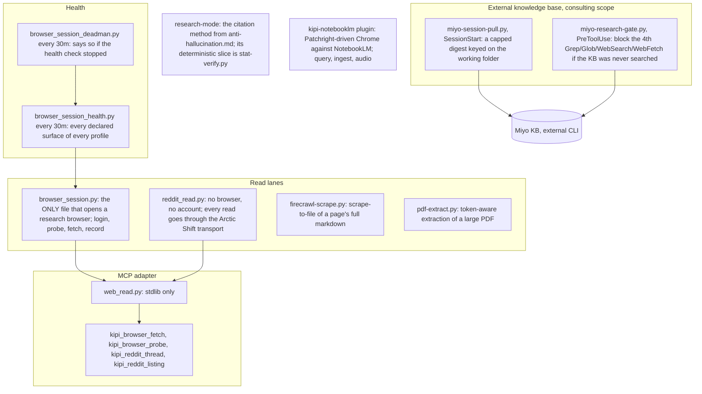

# 13. Research and browser

Two read lanes reach the outside world: a headful research browser that the founder logs
into once and that scripts drive read-only afterward, and a plain HTTP lane for the one
site that still serves a feed without a login. Both are wrapped as MCP tools, both are
probed by a scheduled health check with its own deadman, and a research-mode skill turns
citation requirements on for the model. In the consulting scope, an external knowledge
base is pulled at session start and a gate forces a search of it before deep manual
research.

## Components



Four read lanes, one adapter, two health jobs, one external knowledge base, one skill.
The browser file is the single place a research profile is opened; it has four verbs
(log in by hand once, probe liveness, fetch one URL read-only, record a click path by
walking it once) and a fetchability assertion that refuses file URLs and other unsafe
targets. The Reddit reader uses RSS because every unauthenticated JSON endpoint returns a
403 fleet-wide. Firecrawl and the PDF extractor persist full source text to files so a
citation points at something durable. The adapter exposes the two lanes as four MCP tools
with no third-party dependency. The health job probes every declared surface of every
profile every half hour, and its deadman reports if the prober itself stopped.

## Flow: a research question in the consulting scope

```mermaid
sequenceDiagram
    participant S as Session start
    participant MSP as miyo-session-pull.py
    participant M as Model
    participant MRG as miyo-research-gate.py
    participant BS as browser_session.py
    S->>MSP: SessionStart, cwd under /consulting
    MSP->>MSP: miyo search --limit 6 --json <queries from the folder name>
    MSP-->>M: [miyo kb] capped digest (1,800 chars)
    M->>M: starts researching
    M->>MRG: Grep / Glob / WebSearch / WebFetch (4th call, zero Miyo usages)
    MRG-->>M: exit 2: run a Miyo search first
    M->>M: searches the KB, then continues
    M->>BS: kipi_browser_fetch(url) via web_read.py
    BS->>BS: assert_fetchable(url); load in the headful profile; return HTML, read-only
    BS-->>M: page text with the URL as the citation
```

The knowledge base is pulled before the model asks, keyed on which project folder the
session is in. If the model then starts a manual search spree without touching it, the
gate stops the fourth call and says why; the kill switch and threshold are environment
variables in the founder's shell. A page fetch goes through the one file that may open a
browser, which refuses unsafe URLs before loading anything and never writes to the
profile.

## Every piece

- `browser_session.py`: `login`, `probe`, `fetch`, `record`; `assert_fetchable`; `codegen_argv`. The record lane exists so a click path can be taught by walking it once. A wrapping MCP tool that accepted an agent-supplied output path was built and reverted (an arbitrary file write); the founder's decision in commit cebff6d1 keeps the MCP surface read-only.
- `reddit_read.py`: threads and listings, the reference implementation for the reddit-build-radar instance. Since PR #307 it loads the `reddit_arctic` transport from the kipi-core plugin and refuses to run without it: Arctic Shift is the only way this fleet reads Reddit (founder-directed 2026-09-04). `reddit-transport-audit.py` is that rule as a check, walking the corpus for any other Reddit fetch and exiting 1, wired into pre-commit; `test_reddit_transport_audit.py` proves it flags a reintroduced violation before it proves the clean shape passes, and `test_competitive_intel_reddit_failures.py` pins the failure semantics the competitive-intel tool gained in the same PR, placed under q-system because the plugin's own suite skips itself when its dependencies are absent (sp-97ce589b).
- `firecrawl-scrape.py`: fails closed on an empty result; CJK-safe filenames; key from the environment only.
- `pdf-extract.py`: deterministic extraction sized to a token budget; used by the AI Index comparison.
- `web_read.py` and the four tools `kipi_browser_fetch`, `kipi_browser_probe`, `kipi_reddit_thread`, `kipi_reddit_listing` (page 11).
- `browser_session_health.py`, `browser_session_deadman.py` (launchd, every 30 minutes; page 10).
- `miyo-session-pull.py`, `miyo-research-gate.py` (settings-template only, consulting scope by default; `MIYO_KB_SCOPE`, `MIYO_GATE_OFF`, `MIYO_GATE_THRESHOLD`); `test_miyo_kb_hooks.py`.
- `research-mode` skill: the runtime half of `q-system/methodology/anti-hallucination.md`; every claim carries a citation or a marker.
- `kipi-notebooklm` plugin: `add_notebook`, `ask_question` with session ids, `add_source`, audio overview generation with polling; personal account profile, not on any deterministic path.
- `collection-gate.py`: skip or collect per source (harvest era).

## Scars

- 2026-08-31: the record lane's MCP wrapper accepted an agent-supplied URL and output path, two security majors. Result: the wrapper reverted, the CLAUDE.md line is the wiring.
- Reddit `.json` returns 403 for every unauthenticated call fleet-wide. Result: RSS.
- 2026-08-14: a subagent that did open the required files was still blocked by the read-first gate on a gated target (sp-6ff00dd5); recorded as a live limit, not fixed here.

## Retired

- The harvest sources for LinkedIn, X, Medium, Substack, Notion and calendar under the MCP server's `sources/` directory were fed by the retired pipeline; the declarations remain and the read lanes above are what runs today.
