# 14. Retired and dormant

Surfaces that still exist in the tree but no longer run, or run with nothing consuming
them. They are listed here so a reader does not mistake them for live, and so the decision
that retired each one is findable. Nothing on this page is a candidate for a new feature;
several are candidates for deletion once their remaining callers are gone.

## Components

```mermaid
flowchart TB
    subgraph pipeline [The nine-phase morning pipeline, RETIRED 2026-08-30, RULE-2026-08-30-A]
        ORC[agent-pipeline/agents/step-orchestrator.md + 52 agent prompts]
        BUS[agent-pipeline/bus/YYYY-MM-DD/*.json + schemas/ + BUS-PROTOCOL.md]
        VB[verify-bus.py, verify-orchestrator.py, bus-to-log.py, log-step.py, init-bus-day.sh, audit-morning.py]
        MI[kipi_morning_init, kipi_gate_check: registered, marked RETIRED]
        AG[.claude/agents: preflight, data-ingest, engagement-hitlist, synthesizer, content-reviewer]
        HV[MCP harvest sources: calendar, gmail, linkedin-*, notion-*, x-*, medium, substack, ga4, vc-pipeline, graph-kb]
    end
    subgraph memory [Memory time layers, DORMANT]
        WL[memory/working, weekly, monthly: dirs exist, no writer, no promoter, no reader]
        CM[q-system/.q-system/commands.md: the lifecycle prose, loaded by nothing]
    end
    subgraph misc [Other]
        SK[kipi sync-skills: prints DEPRECATED]
        VD[voice-dna.md as a loaded artifact: the loader's banner says retired]
        ML[plugins/memory-lifecycle: removed from main in 1be3dfd0; the next sync removes it from the 3 instances that still carry it]
        DEB[/q-debrief command file: deleted from the skeleton 2026-03-23; instances carry pre-March copies]
        FCX[com.kipi.fractional-cxo and story-podcast schedules: killed 2026-08-01]
        COLL[linear-collapse-jobmigration.py: ran once]
    end
    MB[morning-brief.py, one deterministic Slack message] -.replaced.-> pipeline
    KI[knowledge-inject.py + knowledge_supply.py] -.replaced the read half of.-> memory
```

Three groups. The morning pipeline was a 37-agent, nine-phase orchestration that
communicated through JSON bus files per day, with `verify-bus.py` and
`verify-orchestrator.py` run between phases; it died silently in April 2026 on two
renamed MCP tool names and was formally retired on 2026-08-30 in favour of one
deterministic brief. Its verifiers, bridges, loggers, agent definitions, bus schemas and
harvest sources remain in the tree; the two MCP entry points still register and say
RETIRED in their own docstrings; the five custom agents remain defined and callable by
command. The memory time layers were documented but never had a
writer, a promoter or a reader, and the prose describing them lives in a file nothing
loads. The rest are single retirements, each with the commit or date that made the call.

## Flow: how a surface gets retired here

```mermaid
stateDiagram-v2
    [*] --> Live
    Live --> Suspected: a detector, an RCA, or a documentation pass finds no caller
    Suspected --> Measured: grep the tree for callers; check the launchd list; read the load path
    Measured --> Live: a caller exists; document the wire instead
    Measured --> Decided: a dated decision in canonical/decisions.md with an origin tag
    Decided --> Marked: the docstring says RETIRED; the rule says retired; this page lists it
    Marked --> Removed: callers gone; deletion through the updater with the deletion guard
    Marked --> Kept: callers remain (a CLI twin, an old instance); stays listed here
    Removed --> [*]
```



Retirement is a measured decision, not a feeling that something is old. A surface stays
live until a grep of the tree, the loaded job list and the actual load path show no caller.
The decision is dated and tagged in the decision log. The surface is then marked in three
places (its own docstring, the rule that mentioned it, and this page), and it is removed
only when its last caller is gone, through the updater, which will refuse to delete anything
an instance owns.

## Every piece

The nine-phase morning pipeline (RULE-2026-08-30-A)
- `q-system/.q-system/agent-pipeline/`: `agents/` (the orchestrator and phase agents), `bus/` (per-day JSON), `schemas/` (bus envelope and per-file schemas), `templates/`, `BUS-PROTOCOL.md`, `orchestrator-design.md`. Placement rule: do not add to it.
- `verify-bus.py`, `verify-orchestrator.py`, `bus-to-log.py`, `log-step.py`, `init-bus-day.sh`, `audit-morning.py`, `run-step-audit.py` (the generic successor still runs), `bus-vocabulary-drift.py`.
- MCP: `kipi_morning_init`, `kipi_gate_check` (RETIRED), and the pipeline-era verifiers on page 11 that remain callable.
- Agents: `preflight`, `data-ingest`, `engagement-hitlist`, `synthesizer`, `content-reviewer`; model tiers still validated by `validate-separation.py`.
- Harvest: `kipi_harvest` and its store, `sources/*.yaml`, `collection-gate.py`, `kipi_queue_notion_write`, `kipi_get_notion_queue`; the Notion queue retry that the morning init used to drain.
- `.claude/rules/morning-pipeline.md` and `self-healing-retry.md`'s morning binding: the rule text remains; the orchestrator it steers does not run.
- Replacement: `morning-brief.py` with its deadman (page 10).

Memory time layers (sp-076fac26)
- `memory/working`, `memory/weekly`, `memory/monthly` and the `ensure_dirs` call in `paths.py` that creates them.
- `q-system/.q-system/commands.md`: the command reference and the lifecycle prose; named only by `folder-structure.md`.
- Decision pending: delete the prose, or fold promotion into `md-prune.py` archival.

Other
- `kipi sync-skills`.
- `voice-dna.md` as a loaded artifact (page 06).
- `plugins/memory-lifecycle` (removed in 1be3dfd0).
- `/q-debrief` command file in the skeleton (sp-4daf4890; the template `methodology/debrief-template.md` is live and is what the flow follows).
- `com.kipi.fractional-cxo`, the story-podcast schedules (2026-08-01 jobs audit; podcast generation itself was left running by decision).
- `linear-collapse-jobmigration.py` (ran once, kept as the record).
- `sources/graph-kb.yaml` (page 05).
- `instance-diet.py`, `instance-diet-fix.sh`, `fix-imports.sh`, `snippet.sh`, `fix-perm-wildcards.py`, `fix-voice-style.py`: one-off repairs kept at the root with their headers as the record.
- `kipi-cluster-add.py` and the KTLYST cluster: the cluster was dissolved 2026-07-07; the verb remains for the next cluster.

## Scars

- April 2026: the pipeline died on two renamed MCP tool names and nobody noticed for
  weeks, because every monitor watched a heartbeat, not the brief landing. Result: the
  retirement, the deadman, and the rule that a monitor watches the capability, not
  liveness.
- 2026-08-24: the memory graph shipped as documentation in every instance and nothing made
  it real; the write path was dead in investigation instances and the read path was
  unwired everywhere. Result: the seed script, the freshness guard, then the reader.

## Retired

This whole page. Every entry above is retired or dormant; the live replacement, where one
exists, is named beside it.
