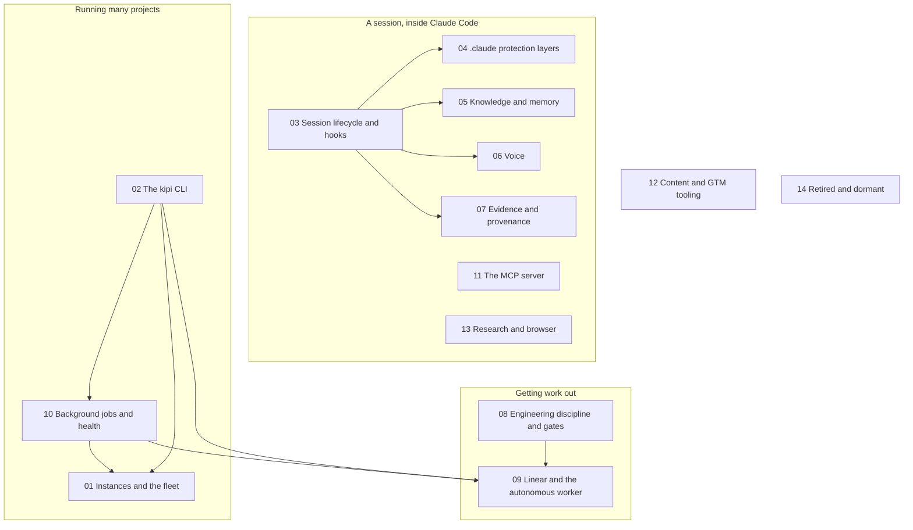

# Systems: how each part of kipi works

Fourteen pages, one per subsystem. Each carries a component diagram (what talks to what), a
flow diagram (what happens in order), every script, tool, hook and job in that subsystem
with its job, inputs, outputs and tests, and a Retired heading where something is kept for
history but no longer runs. The coverage gate `docs/check_coverage.py` holds every one of
these pages to that shape and to naming every surface the code exposes.



The map. Inside a session, the lifecycle page is the spine: hooks fire on every event and
call into the protection, knowledge, voice and evidence subsystems. The MCP server and the
research tools are what the model reaches for during a turn. Getting work out is two pages:
the gates that decide what counts as done, and the Linear queue that carries work through
review to merge. Running many projects is the fleet page, the CLI that drives it, and the
background jobs that keep it healthy. Content tooling stands alone. The last page lists what
is retired, so nobody mistakes an old surface for a live one.

1. [Instances and the fleet](01-instances-and-the-fleet.md)
2. [The kipi CLI](02-the-kipi-cli.md)
3. [Session lifecycle and hooks](03-session-lifecycle-and-hooks.md)
4. [The .claude protection layers](04-claude-protection-layers.md)
5. [Knowledge and memory](05-knowledge-and-memory.md)
6. [Voice](06-voice.md)
7. [Evidence and provenance](07-evidence-and-provenance.md)
8. [Engineering discipline and gates](08-engineering-discipline-and-gates.md)
9. [Linear and the autonomous worker](09-linear-and-the-autonomous-worker.md)
10. [Background jobs and health](10-background-jobs-and-health.md)
11. [The MCP server](11-the-mcp-server.md)
12. [Content and GTM tooling](12-content-and-gtm-tooling.md)
13. [Research and browser](13-research-and-browser.md)
14. [Retired and dormant](14-retired-and-dormant.md)
15. [Tests: every proof in the tree](15-tests.md)

## Where a change lands

```mermaid
flowchart LR
    I([An idea or a bug]) --> P{Bigger than one line?}
    P -->|no| E[edit it]
    P -->|yes| Q[quick-plan: a plan.md with five sections, plan-lint.py holds the shape]
    Q --> H{Gated work?}
    H -->|yes| PRD[prd-os: draft, review, triage, approve, split, issue lifecycle]
    H -->|no| B[build: fable-discipline, tests first, mutation on a copy]
    PRD --> B
    B --> W[/wiring-check: every change reachable, WIRING REPORT]
    W --> PR[PR: verify.sh in CI, reviewer, auto-merge]
    PR --> U[kipi update: preview, approve, fan out]
    U --> R[receipt: the hook fires on a real instance]
```

The route every change takes through the pages above. A one-line change is edited. Anything
larger gets a plan first, whose shape a lint holds. Gated work goes through the PRD
operating system; the rest goes straight to the build discipline. Every build ends with the
wiring check, a pull request the floor script and the reviewer decide, a fan-out the founder
approves once, and a receipt from a real instance that the change is live there.

## Reading a systems page

Every page has the same shape, so the second one is faster than the first:

- **What it is for**, in three sentences.
- **Component diagram** with a plain-English caption.
- **Flow diagram** (a sequence or a state machine) with a caption.
- **Every piece**, grouped: for each script or tool, what it does, what it reads, what it
  writes, what fires it, and what proves it works. Names are exact filenames so a reader
  can open them.
- **Scars**: the recorded failure each guard came from, because a guard without its scar
  reads as arbitrary.
- **Retired**, when the subsystem has any.
